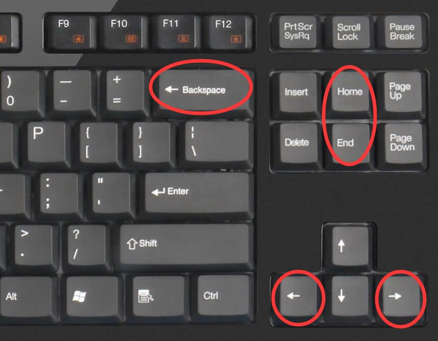

# 第1、2周上机试题

## A 括号匹配（进阶版）

分数 10
作者 朱允刚
单位 吉林大学
编写程序检查给定字符串中包含的括号是否正确匹配，本题中的括号有{ }、[ ]、( )、< >四种。另外再加上一个新的约束条件：当有多种括号嵌套时，嵌套的顺序应为{ → [ → ( → <，即a�Cg+b?[(d?<e�Cf>)]、a+[b+(c�Cd)?e]都是正确的匹配，而a+(b?[c+d])则不是正确匹配。注意本题不允许相同类型括号的嵌套，即a+(b?(c+d))不是正确匹配。本题不需要判断表达式是否合法，只需判断字符串中包含的括号是否正确匹配。

输入格式:
第一行为一个整数n，表示字符串的个数。接下来n行，每行为一个字符串。1<n≤100，字符串长度不超过1000。

输出格式:
对于每个字符串，若为正确匹配则输出"Match" ，若不匹配则输出"Fail"。

输入样例1:

``` data
8
a+(b*[c+d])
g{b[(<c>)d]e}x
[()]
((()))
<>()[]{}
[{}]
x=y+{z+(b)}
][()
```

输出样例1:

```data
Fail
Match
Match
Fail
Match
Fail
Match
Fail
```

输入样例2:

```data
6
{[afds(a<afd>)]}yt
[()rew]
<>()[wre]{}
[{qw}]
rew{(weq)}jjk
<><{}>[][](){[{}]}
```

输出样例2:

```data
Match
Match
Match
Fail
Match
Fail
```

代码长度限制
16 KB
时间限制
50 ms
内存限制
30 MB
栈限制
8192 KB

题解

```cpp
#include <iostream>
#include <cstdio>
#include <stack>
#include <vector>
#include <cstring>
using namespace std;
const int N = 1e3 + 10;
//#define Test
bool JudgeString(char* s);
int main(){
    #ifdef Test
    freopen("file.in", "r", stdin);
    freopen("file.out", "w", stdout);
    #endif
    int n;
    scanf("%d", &n);
    while (n --)
    {
        char s[N];
        scanf("%s", s);
        if(JudgeString(s)) printf("Match");
        else printf("Fail");
        if(n) printf("\n");
    }
    
    return 0;
}
bool JudgeString(char* s){
    int n = strlen(s);
    int a[300];
    stack<int> flag;
    a['{'] = 1; a['['] = 2; a['('] = 3; a['<'] = 4;
    stack<char> st;
    for(int i = 0;i < n;i ++){
        if(s[i] == '{' || s[i] == '[' || s[i] == '(' || s[i] == '<'){
            if(!flag.empty() && flag.top() >= a[s[i]]) return false;
            flag.push(a[s[i]]);
            st.push(s[i]);
        } else if(s[i] == '}'){
            if(st.empty() || !st.empty() && st.top() != '{') return false;
            else st.pop(), flag.pop();
        } else if(s[i] == ']'){
            if(st.empty() || !st.empty() && st.top() != '[') return false;
            else st.pop(), flag.pop();
        } else if(s[i] == ')'){
            if(st.empty() || !st.empty() && st.top() != '(') return false;
            else st.pop(), flag.pop();
        } else if(s[i] == '>'){
            if(st.empty() || !st.empty() && st.top() != '<') return false;
            else st.pop(), flag.pop();
        }
    }
    return st.empty();
}
```

## B 调皮的哈利

分数 10
作者 朱允刚
单位 吉林大学
贝蒂是个打字高手，打字时有不看屏幕的习惯。在一次贝蒂打字时，调皮的哈利常常趁贝蒂不注意按下Home键、End键、左右方向键和退格键。当Home键被按下时，输入光标会跳到文本最开头；当End键被按下时，输入光标会跳到文本末尾；当左/右方向键被按下时，输入光标会向左/右移动一位；当退格键被按下时，输入光标左面的一个字符会被删除。现给出贝蒂和哈利按键的字符串，其中'{'表示Home键，'}'表示End键，'<'表示左方向键，'>'表示右方向键，'#'表示退格键，其余字符均表示输入的内容，请输出屏幕上最终显示的文本。



输入格式:
输入一个字符串，长度不超过$5×10^4$，包含大小写字母、空格、下划线、{、}、<、>、#，表示贝蒂和哈利的按键序列。

输出格式:
输出为屏幕上最终显示的字符串。

输入样例1:

```data
jlu_cc{i_love_}st
```

输出样例1:

```data
i_love_jlu_ccst
```

输入样例2:

```data
stre<<aaa
```

输出样例2:

```data
staaare
```

输入样例3:

```data
xxx>>>yyy##z<<>k
```

输出样例3:

```data
xxxykz
```

输入样例4:

```data
abcd{efghi}jklm{nopq}rs{t}uvwxyz
```

输出样例4:

```data
tnopqefghiabcdjklmrsuvwxyz
```

代码长度限制
16 KB
时间限制
25 ms
内存限制
10 MB
栈限制
8192 KB

题解

```cpp
#include <iostream>
#include <cstdio>
#include <cstring>
#include <stack>
#include <deque>
using namespace std;
//#define Test
const int N = 5e4 + 10;
struct ListNode{
    char val;
    ListNode* pre;
    ListNode* next;
    ListNode(int v): val(v), pre(nullptr),next(nullptr){}
    ListNode():val(' '), pre(nullptr), next(nullptr){}
};
ListNode* DeleteNode(ListNode* cur);
ListNode* InsertNode(ListNode* cur, char val);
ListNode* root = new ListNode();
ListNode* last = new ListNode();
int main(){
    #ifdef Test
    freopen("file.in", "r", stdin);
    freopen("file.out", "w", stdout);
    #endif
    char s[N], ans[N];
    cin.getline(s, N);
    int n = strlen(s);
    root->next = last;
    last->pre = root;
    ListNode* p = root;
    for(int i = 0;i < n;i ++){
        if(s[i] == '{'){
            p = root;
        } else if(s[i] == '}'){
            p = last->pre;
        } else if(s[i] == '<'){
            if(p->pre)
            p = p->pre;
        } else if(s[i] == '>'){
            if(p->next && p->next != last)
            p = p->next;
        } else if(s[i] == '#'){
            p = DeleteNode(p);
        } else{
            p = InsertNode(p, s[i]);
        }
    }
    p = root->next;
    int i = 0;
    while (p->next != nullptr)
    {
        ans[i ++] = p->val;
        p = p->next;
    }
    cout << ans;
    return 0;
}

ListNode* DeleteNode(ListNode* cur){
    if(cur == root || cur == last) return cur;
    ListNode* preNode = cur->pre;
    ListNode* nextNode = cur->next;
    preNode->next = nextNode;
    nextNode->pre = preNode;
    cur = preNode;
    return cur;
}
ListNode* InsertNode(ListNode* cur, char val){
    ListNode* p = new ListNode(val);
    ListNode* NextNode = cur->next;
    cur->next = p;
    p->next = NextNode;
    p->pre = cur;
    NextNode->pre = p;
    return p;
}
```

## C 表达式求值

分数 10
作者 朱允刚
单位 吉林大学
给定一个中缀表达式，请编写程序计算该表达式的值。表达式包含$+、-、*、/\^、、(、)$，所有运算均为二元运算，操作数均为正整数，但可能不止一位，不超过10位。运算结果为整数，值域为$[?2^{31} ,2^{31})$。除法运算结果若为小数则进行截尾取整。若除法运算中除数为0，则输出INVALID。幂运算须自行实现，不允许调用pow等系统函数。测试数据保证幂运算中指数为非负，底数不为0。

输入格式:
输入为多行，每行为一个长度不超过1000的字符串，表示中缀表达式。

输出格式:
对每个表达式输出一行：为一个整数（表达式的值）或为一个字符串INVALID。

输入样例:
5+(10*2)-6
8*(999+1)
1+5/(1-1)
7*2^3

输出样例:
19
8000
INVALID
56
代码长度限制
16 KB
时间限制
50 ms
内存限制
64 MB
栈限制
8192 KB

题解

```cpp
#include <iostream>
#include <cstdio>
#include <stack>
#include <cstring>
//#define Test
const int N = 1e3 + 10;
using namespace std;
void func(char* s);
bool Calculate(stack<int>& num, stack<char>& op);
int MyPow(int x, int n);
int main(){
    #ifdef Test
    freopen("file.in", "r", stdin);
    freopen("file.out", "w", stdout);
    #endif
    char s[N];
    int cnt = 0;
    while (1)
    {
        memset(s, 0, sizeof(s));
        cin >>  s;
        if(strlen(s) == 0) break;
        cnt ++;
        if(cnt > 1) printf("\n");
        func(s);
    }
    return 0;
}
void func(char* s){
    stack<char> op;
    stack<int> num;
    int a[300];
    a['+'] = a['-'] = 1;
    a['*'] = a['/'] = 2;
    a['^'] = 3;
    a['('] = 0;
    int n = strlen(s);
    for(int i = 0;i < n;i ++){
        if(isalnum(s[i])){
            int j = i, tmp = 0;
            while (isalnum(s[j]))
            {
                tmp = tmp * 10 + s[j] - '0';
                j ++;
            }
            i = j - 1;
            num.push(tmp);
        } else if(s[i] == '+' || s[i] == '-' || s[i] == '*' || s[i] == '/' || s[i] == '^'){
            while (!op.empty() && a[op.top()] >= a[s[i]])
            {
                if(!Calculate(num, op)){
                    printf("INVALID");
                    return;
                }
            }
            op.push(s[i]);
        } else if(s[i] == '('){
            op.push('(');
        } else if(s[i] == ')'){
            while (!op.empty() && op.top() != '(')
            {
                if(!Calculate(num, op)){
                    printf("INVALID");
                    return;
                }
            }
            if(!op.empty() && op.top() == '(') op.pop();
        }
    }
    while (!op.empty())
    {
        if(!Calculate(num, op)){
            printf("INVALID");
            return;
        }
    }
    printf("%d", num.top());
}
bool Calculate(stack<int>& num, stack<char>& op){
    int num2 = num.top(); num.pop();
    int num1 = num.top(); num.pop();
    char f = op.top(); op.pop();
    switch (f)
    {
    case '+':
        num.push(num1 + num2);
        break;
    case '-':
        num.push(num1 - num2);
        break;
    case '*':
        num.push(num1 * num2);
        break;
    case '/':
        if(num2 == 0) return false;
        num.push(num1 / num2);
        break;
    case '^':
        num.push(MyPow(num1, num2));
        break;
    default:
        break;
    }
    return true;
}
int MyPow(int x, int n){
    if(n == 0) return 1;
    int res = MyPow(x, n / 2);
    int ans = res * res;
    if(n % 2) ans *= x;
    return ans;
}
```

## D EDG

分数 10
作者 朱允刚
单位 吉林大学
2021年11月6日，英雄联盟全球总决赛打响，中国电子竞技战队Edward Gaming（EDG）以3:2力克韩国强敌DWG KIA（DK）战队，历史上首次夺得全球总冠军。一时间全网沸腾，大家纷纷在社交平台上直呼“edgnb”。现给定一段文本，请编写程序识别出连续的k个“edgnb”组成的字符串在该文本中出现了多少次。

输入格式:
第一行为1个整数T，表示数据组数。对于每组数据，第一行为1个字符串，表示给定的文本。第二行为1个整数k，含义如题目所述。（1≤T≤10。各组数据给定的字符串长度之和不超过$10^5$，且字符串中只包含a-z的小写字母。k≥1且k×5小于给定字符串长度）。

输出格式:
对于每组数据输出一行，为1个整数，表示所求的出现次数。

输入样例:

```data
5
xyzedgnbabcedgnb
1
xyzedgnbabcedgnb
2
defedgnbedgnbxyz
2
edgnbedgnbedgnb
2
fxedgnbedgnbedgnbedgnbmem
3
```

输出样例:

```data
2
0
1
2
2
```

数据规模:
测试点0：5≤T≤10，400≤T个字符串长度之和≤500，k=1
测试点1：5≤T≤10，400≤T个字符串长度之和≤500，k≥1
测试点2：5≤T≤10，4000≤T个字符串长度之和≤5000，k≥1
测试点3：1≤T≤3，90000≤T个字符串长度之和≤100000，k≥1
测试点4：1≤T≤3，90000≤T个字符串长度之和≤100000，k≥1

代码长度限制
16 KB
时间限制
400 ms
内存限制
64 MB
栈限制
8192 KB

题解

```cpp
#include <iostream>
#include <cstdio>
#include <cstring>
using namespace std;
//#define Test
const int N = 1e5 + 10;
void KMP(char* text, int k);
int main(){
    #ifdef Test
    freopen("file.in", "r", stdin);
    freopen("file.out", "w", stdout);
    #endif
    int t;
    scanf("%d", &t);
    for(int i = 0;i < t;i ++){
        char text[N];
        int k;
        scanf("%s%d", text, &k);
        KMP(text, k);
        printf("\n");
    }
    return 0;
}
void KMP(char* text, int k){
    char model[100] = "edgnb";
    int lenOfModel = strlen(model);
    int lenOftext = strlen(text);
    int Next[100] = {0}; 
    Next[0] = -1;
    for(int i = 0;i < lenOfModel;i ++){
        int k = Next[i];
        while (k >= 0 && model[i] != model[k])
        {
            k = Next[k];
        }
        Next[i + 1] = ++k;
    }
    int modelcnt = 0, allcnt = 0;
    for(int i = 0, j = 0;i < lenOftext && j < lenOfModel;){
        if(j < 0 || text[i] == model[j]){i ++; j ++;}
        if(j == lenOfModel){
            modelcnt ++;
            if(modelcnt == k){
                modelcnt = k - 1;
                allcnt ++;
                j = 0;
            } else if(modelcnt < k){
                j = 0;
            }
        }
        if(text[i] != model[j]){
            j = Next[j];
            modelcnt = 0;
        }
    }
    printf("%d", allcnt);
}
```

## E 字母游戏

分数 10
作者 朱允刚
单位 吉林大学
波比和哈丽在玩一个字母游戏，波比给出一个字符串S，要求哈丽按照一定规则，基于该字符串算出一个数字X。

规则是：

（1）求出S的最长重复后缀P（P是S的后缀且在S中出现大于1次，例如yacbacba的最长重复后缀是acba），

（2）求出在S中去除第二长相等前后缀（S中所有相等的前后缀中第2长者，例如abcabcxxxabcabc中最长相等前后缀是abcabc，第二长的相等前后缀则是abc）后剩下的子串Q（例如abcabcxxxabcabc去除第二长相等前后缀后，剩下abcxxxabc）。

则X=P的长度+Q的长度。

注意一个字符串不能称为自己的前缀或后缀。子串Q至少为空串，其长度大于等于0，不能为负数。

请编写程序帮助哈丽根据给定字符串S，根据上述规则计算出数字X。

输入格式:
输入为若干行，每行为一个字符串，包含不超过100000个字母。

输出格式:
输出为若干行，每行一个整数，表示输入字符串所计算出的数字。

输入样例:

```data
abcabcxxxabcabc
xacbacba
abc
aaa
```

输出样例:

```data
15
12
3
3
```

代码长度限制
16 KB
时间限制
20 ms
内存限制
64 MB
栈限制
8192 KB

题解

```cpp
#include <iostream>
#include <cstdio>
#include <cstring>
using namespace std;
//#define Test
const int N = 1e5 + 10;
int func(char* s);
void GetNext(int* Next, char* s);
int main(){
    #ifdef Test
    freopen("file.in", "r", stdin);
    freopen("file.out", "w", stdout);
    #endif
    while (1)
    {
        char s[N];
        cin.getline(s, N); // 这边还有一个诡异的问题，为什么用scanf("%s");读取就跳不出循环
        if(strlen(s) == 0) break;
        printf("%d\n", func(s));
    }
    return 0;
}
int func(char* s){
    int Len = strlen(s);
    char p[N];
    int NextOfP[N] = {0}, NextOfS[N] = {0};
    for(int i = 0;i < Len;i ++) p[i] = s[Len - 1 - i];
    GetNext(NextOfP, p);
    GetNext(NextOfS, s);
    int MaxLen = 0;
    for(int i = 0;i < Len;i ++) MaxLen = max(MaxLen, NextOfP[i + 1]);
    #ifdef Test
    printf("maxlen:%d\n", MaxLen);
    printf("nextofs[nextofs[len]]:%d\n", NextOfS[NextOfS[Len]]);
    #endif
    int SecondRes = NextOfS[NextOfS[Len]] >= 0 ? NextOfS[NextOfS[Len]] : 0;
    SecondRes = Len - SecondRes * 2 >= 0 ? Len - SecondRes * 2 : 0;
    return MaxLen + SecondRes;
}
void GetNext(int* Next, char* s){
    Next[0] = -1;
    int n = strlen(s);
    for(int i = 0;i < n;i ++){
        int k = Next[i];
        while (k >= 0 && s[i] != s[k])
        {
            k = Next[k];
        }
        Next[i + 1] = ++k;
    }
}
```

## F 小龙猜数字

分数 10
作者 朱允刚
单位 吉林大学
我们称一个字符串的秩为：该字符串长度减去该字符串的最短相等前后缀的长度。若该字符串不存在相等的前后缀，则其秩为0。

例如：abcabcxabcabc最短相等前后缀为abc，该字符串的秩为10。

Pororo和小龙玩猜字游戏，Pororo给出一个字符串S，小龙需计算S及S中所有前缀子串的秩之和。请编写程序帮助小龙猜数字。

输入格式:
输入为2行，第1行为字符串S的长度，第2行为具体的字符串。字符串长度不超过$10^6$ 。

输出格式:
输出 一个整数表示字符串S及其所有前缀的秩之和。

注：结果超出int型变量范围，请使用long long型变量。

输入样例1:

```data
6
ababab
```

输出样例1:

```data
12
```

样例1解释:
a的秩为0，ab的秩为0，aba的秩为2，abab的秩为2，ababa的秩为4，ababab的秩为4。

输入样例2:

```data
10
bbcabbabbc
```

输出样例2:

```data
32
```

代码长度限制
16 KB
时间限制
50 ms
内存限制
64 MB
栈限制
8192 KB

题解

```cpp
#include <iostream>
#include <cstdio>
#include <cstring>
using namespace std;
const int N = 1e6 + 10;
//#define Test
long long KMP(char* s, int n);
int main(){
    #ifdef Test
    freopen("file.in", "r", stdin);
    freopen("file.out", "w", stdout);
    #endif
    int n;
    char tmp[10], s[N];
    cin >> n;
    scanf("%c", tmp);
    cin.getline(s, N);
    printf("%lld\n", KMP(s, n));
    return 0;
}
long long KMP(char* s, int n){
    int Len = n;
    int Next[N] = {0};
    Next[0] = -1;
    for(int i = 0;i < Len;i ++){
        int k = Next[i];
        while (k >= 0 && s[i] != s[k])
        {
            k = Next[k];
        }
        Next[i + 1] = ++ k;
    }
    for(int i = 0;i < Len;i ++){
        while (Next[i + 1] > 0 && Next[Next[i + 1]] > 0)
        {
            Next[i + 1] = Next[Next[i + 1]];
        }

    }
    long long sum = 0;
    for(int i = 0;i < Len;i ++)
        if(Next[i + 1] == 0) sum += 0;
        else sum += i + 1 - Next[i + 1];
    return sum;
}
```
