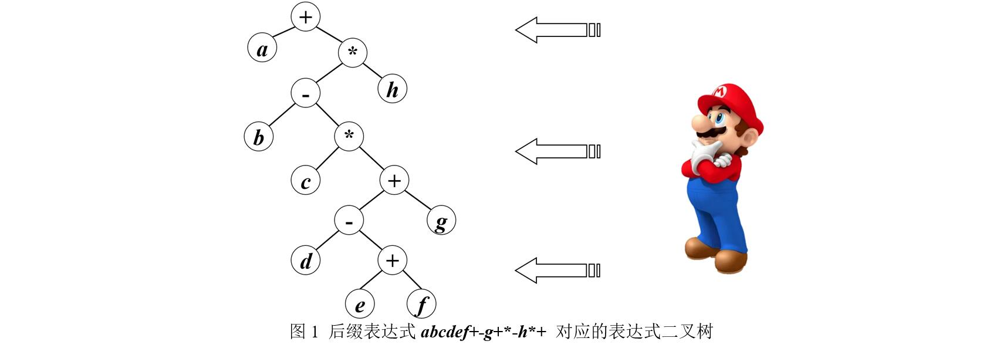

# 第3、4周上机试题

## A 二叉树删除子树

分数 10
作者 朱允刚
单位 吉林大学
编写程序对给定二叉树执行若干次删除子树操作，输出每次删除子树后剩余二叉树的中根序列。二叉树结点的数据域值为不等于0的整数。每次删除操作是在上一次删除操作后剩下的二叉树上执行。

输入格式:
输入第1行为一组用空格间隔的整数，表示带空指针信息的二叉树先根序列，其中空指针信息用0表示。例如1 5 8 0 0 0 6 0 0表示如下图的二叉树。第2行为整数m，表示要进行的删除操作次数。接下来m行，每行一个不等于0的整数K，表示要删除以K为根的子树。m不超过100，二叉树结点个数不超过5000。输入数据保证各结点数据值互不相等，且删除子树后二叉树不为空。


输出格式:
输出为m行，每行为一组整数，表示执行删除操作后剩余二叉树的中根序列（中根序列中每个整数后一个空格）。若要删除的子树不在当前二叉树中，则该行输出0（0后无空格）。

输入样例:

```data
1 5 8 0 0 0 6 0 0
3
5
8
6
```

输出样例:

```data
1 6 
0
1 
```

代码长度限制
16 KB
时间限制
100 ms
内存限制
10 MB
栈限制
8192 KB

题解

```cpp
#include <iostream>
#include <cstdio>
using namespace std;
//#define Test
struct TreeNode{
    int val;
    TreeNode* Left, *Right;
    TreeNode(): val(0), Left(nullptr), Right(nullptr){}
    TreeNode(int x): val(x), Left(nullptr), Right(nullptr){}
    TreeNode(int x, TreeNode* l, TreeNode* r): val(x), Left(l), Right(r){}
};
TreeNode* BuildTree();
void PrintIn(TreeNode* p);
bool FindDeleteTree(int k, TreeNode* p);
void DeleteTree(TreeNode* p);
int main(){
    #ifdef Test
    freopen("file.in", "r", stdin);
    freopen("file.out", "w", stdout);
    #endif
    TreeNode* root = BuildTree();
    int m;
    scanf("%d", &m);
    for(int i = 0;i < m;i ++){
        int k;
        scanf("%d", &k);
        if(root && root->val == k){
            DeleteTree(root);
            root = nullptr;
            PrintIn(root);
        } else if(root && root->val != k){
            if(FindDeleteTree(k, root)) PrintIn(root);
            else printf("0");
        }
        else printf("0");
        puts("");
    }
    return 0;
}
TreeNode* BuildTree(){
    int tmp;
    scanf("%d", &tmp);
    if(!tmp) return nullptr;
    TreeNode* p = new TreeNode(tmp);
    p->Left = BuildTree();
    p->Right = BuildTree();
    return p;
}
void PrintIn(TreeNode* p){
    if(!p) return;
    PrintIn(p->Left);
    printf("%d ", p->val);
    PrintIn(p->Right);
}
bool FindDeleteTree(int k, TreeNode* p){
    if(!p) return false;
    if(p->Left && p->Left->val == k){
        DeleteTree(p->Left);
        p->Left = nullptr;
        return true;
    }
    if(p->Right && p->Right->val == k){
        DeleteTree(p->Right);
        p->Right = nullptr;
        return true;
    }
    return FindDeleteTree(k, p->Left) || FindDeleteTree(k, p->Right);
}
void DeleteTree(TreeNode* p){
    if(!p) return;
    DeleteTree(p->Left);
    p->Left = nullptr;
    DeleteTree(p->Right);
    p->Right = nullptr;
    delete p;
    p = nullptr;
}
```

## B 重建二叉树

分数 10
作者 朱允刚
单位 吉林大学
给定非空二叉树的中根序列和后根序列，请编写程序创建该二叉树，计算其高度和先根序列；如给定的中根和后根序列不合法，则亦能识别。

输入格式:
输入包含多组数据（不超过10组），每组为两行字符串，第一行表示某二叉树的后根序列，第二行表示其中根序列。结点的值均为A-Z的大写字母，故二叉树结点个数不超过26，且保证输入的两个序列都是结点的全排列，但不一定是合法的中根和后根序列。输入保证不是空二叉树。

输出格式:
对于每组数据，如果输入的序列不合法（不是同一棵树的中根序列和后根序列），则输出INVALID；若输入序列合法，输出为两行，第一行为一个整数，表示该二叉树的高度，第二行为一个字符串，表示该二叉树的先根序列。

输入样例1:

```data
CEFDBHGA
CBEDFAGH
CBEDFAGH
CEFDBHGA
BCA 
CAB
```

输出样例1:

```data
3
ABCDEFGH
INVALID
INVALID
```

代码长度限制
16 KB
时间限制
50 ms
内存限制
64 MB
栈限制
8192 KB

题解

```cpp
#include <iostream>
#include <cstdio>
#include <cstring>
#include <deque>
#include <vector>
using namespace std;
//#define Test
const int N = 1e2;
struct TreeNode{
    char val;
    TreeNode* Left, *Right;
    TreeNode(): val(0), Left(nullptr), Right(nullptr){}
    TreeNode(int x): val(x), Left(nullptr), Right(nullptr){}
    TreeNode(int x, TreeNode* l, TreeNode* r): val(x), Left(l), Right(r){}
};
TreeNode* BuildTree(vector<char>& Inorder, vector<char>& postOrder, int& Flag);
int GetDepth(TreeNode* p);
void PrintPre(TreeNode* p);
int main(){
    #ifdef Test
    freopen("file.in", "r", stdin);
    freopen("file.out", "w", stdout);
    #endif
    char PostOrder[N], InOrder[N];
    while (1)
    {
        memset(PostOrder, 0, sizeof(PostOrder));
        memset(InOrder, 0, sizeof(InOrder));
        scanf("%s", PostOrder);
        if(strlen(PostOrder) == 0) break;
        scanf("%s", InOrder);
        vector<char> Post, In;
        int Len = strlen(PostOrder);
        for(int i = 0;i < Len;i ++) Post.push_back(PostOrder[i]), In.push_back(InOrder[i]);
        int Flag = 1;
        TreeNode* root = BuildTree(In, Post, Flag);
        if(!root) printf("INVALID\n");
        else{
            printf("%d\n", GetDepth(root) - 1);
            PrintPre(root);
            printf("\n");
        }
    }
    
    return 0;
}
TreeNode* BuildTree(vector<char>& Inorder, vector<char>& postOrder, int& Flag){
    int len = Inorder.size();
    if(!len) return nullptr;
    char rootval = postOrder[len - 1];
    int position = -1;
    for(int i = 0;i < len;i ++){
        if(Inorder[i] == rootval){
            position = i;
            break;
        }
    }
    if(position == -1){
        Flag = 0;
        return nullptr;
    }
    TreeNode* root =  new TreeNode(rootval);
    vector<char> LeftTreeInOrder = vector<char>(Inorder.begin(), Inorder.begin() + position);
    vector<char> LeftTreePostOrder = vector<char>(postOrder.begin(), postOrder.begin() + position);
    vector<char> RightTreeInorder = vector<char>(Inorder.begin() + position + 1, Inorder.end());
    vector<char> RightTreePostOrder = vector<char>(postOrder.begin() + position, postOrder.begin() + len - 1);

    root->Left = BuildTree(LeftTreeInOrder, LeftTreePostOrder, Flag);
    root->Right = BuildTree(RightTreeInorder, RightTreePostOrder, Flag);
    return Flag == 1 ? root : nullptr;
}
void PrintPre(TreeNode* p){
    if(!p) return;
    printf("%c", p->val);
    PrintPre(p->Left);
    PrintPre(p->Right);
}
int GetDepth(TreeNode* p){
    if(!p) return 0;
    int LeftDepth = GetDepth(p->Left);
    int RightDepth = GetDepth(p->Right);
    return 1 + max(LeftDepth, RightDepth);
}
```

## C 最右子表达式

分数 10
作者 朱允刚
单位 吉林大学
表达式可以对应一个树结构，称为表达式树。其中的叶结点对应表达式中的操作数，非叶结点对应运算符，假定所有运算均为二元运算。根据后缀表达式可以构造出表达式二叉树，方法是：从左向右扫描后缀表达式，每扫描到一个符号就生成一个二叉树结点，该符号作为结点的数据域值；若扫描到的符号是操作数，则将此操作数结点压栈；若扫描到的符号是运算符，则从栈中弹出两个结点，分别作为当前运算符结点的右、左孩子，再将当前运算符结点压栈。表达式扫描完成后，栈顶即为表达式树的根结点。表达式树的后根序列即为后缀表达式。

现给定一个后缀表达式exp，请编写程序求出exp的“最右子表达式”。exp的“最右子表达式”是指从exp对应的表达式树右边看向树，从第0层到最底层所能看到的各结点。例如后缀表达式$$abcdef+?g+??h?+$$对应的表达式树如图1所示，其最右子表达式为 $$+?h?+g+f$$ 。



输入格式:
第一行是正整数n，表示后缀表达式的数目，1<n≤100。接下来n行，每行是一个由字母构成的字符串，长度不超过500，表示一个后缀表达式，其中小写字母表示操作数，大写字母表示运算符。所有运算符均为二元运算符。

输出格式:
对每个后缀表达式，输出其“最右子表达式”。

输入样例1:

```data
6
abcdefXYgXZYhZX
xyPzwIM
abcABdefgCDEF
abcMN
bcMaN
fgCeDdEbcAaBF
```

输出样例1:

```data
XZhZXgXf
MIw
FEDCg
NMc
Nac
FBacg
```

输入样例2:

```data
6
vesBdtIBU
crpNWgaQmGG
jhAhRnlCJzU
laaKuqBHfzVEJ
rngAlKCpwgFIM
kcqoDYoDeqiYFDL
```

输出样例1:

```data
UBIt
GGma
UzClh
JEVzq
MIFgg
LDFYio
```

代码长度限制
16 KB
时间限制
50 ms
内存限制
30 MB
栈限制
8192 KB

题解

```cpp
#include <iostream>
#include <cstdio>
#include <cstring>
#include <deque>
#include <stack>
using namespace std;
//#define Test
const int N = 1e3;
void Func(char* s);
struct TreeNode{
    char val;
    TreeNode* Left, *Right;
    TreeNode(): val(0), Left(nullptr), Right(nullptr){}
    TreeNode(char x): val(x), Left(nullptr), Right(nullptr){}
    TreeNode(char x, TreeNode* l, TreeNode* r): val(x), Left(l), Right(r){}
};
int main(){
    #ifdef Test
    freopen("file.in", "r", stdin);
    freopen("file.out", "w", stdout);
    #endif
    char s[N];
    int n;
    scanf("%d", &n);
    getchar();
    while (n --)
    {
        memset(s, 0, sizeof(s));
        cin.getline(s, N);
        Func(s);
    }
    return 0;
}
void Func(char* s){
    int n = strlen(s);
    stack<TreeNode*> st;
    TreeNode* p;
    for(int i = 0;i < n;i ++){
        p = new TreeNode(s[i]);
        if(s[i] >= 'a' && s[i] <= 'z') st.push(p);
        else {
            p->Right = st.top(); st.pop();
            p->Left = st.top(); st.pop();
            st.push(p);
        }
    }
    deque<TreeNode*> dq;
    dq.push_back(p);
    while (!dq.empty())
    {
        int size = dq.size();
        if(size > 0) printf("%c", dq.back()->val);
        for(int i = 0;i < size;i ++){
            p = dq.front(); dq.pop_front();
            if(p->Left) dq.push_back(p->Left);
            if(p->Right) dq.push_back(p->Right);
        }
    }
    puts("");
}
```

## D 哈夫曼树

分数 10
作者 朱允刚
单位 吉林大学
编写一个哈夫曼编码译码程序。针对一段文本，根据文本中字符出现频率构造哈夫曼树，给出每个字符的哈夫曼编码，并进行译码，计算编码前后文本大小。
为确保构建的哈夫曼树唯一，本题做如下限定：

选择根结点权值最小的两棵二叉树时，选取权值较小者作为左子树。
若多棵二叉树根结点权值相等，则先生成的作为左子树，后生成的作为右子树，具体来说：
i 对于单结点二叉树，优先选择根结点对应字母在文本中最先出现者，如文本为cba，三个字母均出现1次，但c在文本中最先出现，b第二出现，故则选择c作为左子树，b作为右子树。
ii 对于非单结点二叉树，先生成的二叉树作为左子树，后生成的二叉树作为右子树。
iii. 若单结点和非单结点二叉树根结点权值相等，优先选择单结点二叉树。
生成哈夫曼编码时，哈夫曼树左分支标记为0，右分支标记为1。
输入格式:
输入为3行。第1行为一个字符串，包含不超过5000个字符，至少包含两个不同的字符，每个字符为a-z的小写字母。第2、3行为两个由0、1组成的字符串，表示待译码的哈夫曼编码。

输出格式:
输出第一行为用空格间隔的2个整数，分别为压缩前后文本大小，以字节为单位，一个字符占1字节，8个二进制位占1字节，若压缩后文本不足8位，则按1字节算。输出从第二行开始，每行为1个字符的哈夫曼编码，按各字符在文本中出现次数递增顺序输出，若多个字符出现次数相同，则按其在文本出现先后排列。每行格式为“字母:编码”。最后两行为两行字符串，表示译码结果，若译码失败，则输出INVALID。

输入样例:

```data
cbaxyyzz
0100
011
```

输出样例:

```data
8 3
c:100
b:101
a:110
x:111
y:00
z:01
zy
INVALID
```

代码长度限制
16 KB
时间限制
50 ms
内存限制
64 MB
栈限制
8192 KB

题解

```cpp
#include <iostream>
#include <algorithm>
#include <cstdio>
#include <cstring>
#include <vector>
#include <deque>
#include <cmath>
#include <unordered_map>
using namespace std;
//#define Test
struct HuffumanNode
{
    char val;
    int ApperanceTime;
    long long weight;
    vector<int> code;
    HuffumanNode* left, *right;
    HuffumanNode(long long w, char v): weight(w), val(v), left(nullptr), right(nullptr){}
};
typedef long long ll;
const int MaxN = 300;
const int MaxLength = 5e3 + 10;
const int MaxCode = 1e5 + 10;
long long HuffmanSumWeight; 
int MaxCodeSize;
unordered_map<string, char> DecodeLength;
int BuildHuffmanNode(char* s, HuffumanNode* H[]);
HuffumanNode* BuildHuffmanTree(HuffumanNode* H[], int n);
bool Cmp(HuffumanNode* a, HuffumanNode* b);
void GetHuffmanCode(HuffumanNode* root);
void PrintHuffumanCode(HuffumanNode* root);
bool DecodeHuffumanString(char* s);
void TestForDecode();
int main(){
    #ifdef Test
    freopen("file.in", "r", stdin);
    freopen("file.out", "w", stdout);
    #endif
    HuffumanNode* H[300] = {0};
    char s[MaxLength], Code1[MaxCode], Code2[MaxCode];
    cin.getline(s, MaxLength);
    cin.getline(Code1, MaxCode);
    cin.getline(Code2, MaxCode);
    int n = BuildHuffmanNode(s, H);
    HuffumanNode* root = BuildHuffmanTree(H, n);
    GetHuffmanCode(root);
    if(HuffmanSumWeight % 8)
        HuffmanSumWeight = HuffmanSumWeight / 8 + 1;
    else HuffmanSumWeight /= 8;
    printf("%d %lld\n", strlen(s), HuffmanSumWeight);
    PrintHuffumanCode(root);
    //TestForDecode();
    if(!DecodeHuffumanString(Code1)) printf("INVALID\n");
    if(!DecodeHuffumanString(Code2)) printf("INVALID\n");
    return 0;
}
int BuildHuffmanNode(char* s, HuffumanNode* H[]){
    int Freq[MaxN] = {0}, index = 0;
    for(int i = 0;i < strlen(s);i ++)
        if(s[i] >= 'a' && s[i] <= 'z')
            Freq[s[i] - 'a'] ++;
    for(int i = 0;i < strlen(s);i ++){
        if(Freq[s[i] - 'a']){
            H[index] = new HuffumanNode(Freq[s[i] - 'a'], s[i]);
            H[index]->ApperanceTime = index;
            index ++;
            Freq[s[i] - 'a'] = 0;
        }
    }
    sort(H, H + index, Cmp);
    return index;
}
bool Cmp(HuffumanNode* a, HuffumanNode* b){
    if(a->weight == b->weight)
        return a->ApperanceTime < b->ApperanceTime;
    return a->weight < b->weight; // 此处后面可能待调
}
bool Cmp2(HuffumanNode* a, HuffumanNode* b){
    if(a->weight == b->weight)
        return a->ApperanceTime < b->ApperanceTime;
    return a->weight < b->weight;
}
HuffumanNode* BuildHuffmanTree(HuffumanNode* H[], int n){
    for(int i = 0;i < n - 1;i ++){
        long long t = H[i]->weight + H[i + 1]->weight;
        HuffumanNode* tmp = new HuffumanNode(t, '+');
        tmp->left = H[i], tmp->right = H[i + 1];
        int j = i + 2;
        while (j < n && H[j]->weight <= t)
        {
            H[j - 1] = H[j];
            j ++;
        }
        H[j - 1] = tmp;
    }
    return H[n - 1];
}
void TestForDecode(){
    for(auto i : DecodeLength){
        cout << i.first;
        printf(" %c\n", i.second);
    }
}
void GetHuffmanCode(HuffumanNode* root){
    if(!root) return ;
    if(root->left){
        root->left->code = root->code;
        root->left->code.push_back(0);
        GetHuffmanCode(root->left);
    }
    if(root->right){
        root->right->code = root->code;
        root->right->code.push_back(1);
        GetHuffmanCode(root->right);
    }
    if(!root->left && !root->right){
        int len = root->code.size();
        MaxCodeSize = max(MaxCodeSize, len);
        string s;
        for(int i = 0;i < len;i ++)
            s += to_string(root->code[i]);
        DecodeLength[s] = root->val;
        HuffmanSumWeight += root->code.size() * root->weight;
    }
}
void PrintHuffumanCode(HuffumanNode* root){
    if(!root) return ;
    HuffumanNode* p = root;
    HuffumanNode* PrintNode[MaxN] = {0};
    deque<HuffumanNode*> dq;
    dq.push_back(p);
    int index = 0;
    while (!dq.empty())
    {
        int size = dq.size();
        for(int i = 0;i < size;i ++){
            p = dq.front(); dq.pop_front();
            if(!p->left && !p->right) PrintNode[index ++] = p;
            if(p->right) dq.push_back(p->right);
            if(p->left) dq.push_back(p->left);
        }
    }
    sort(PrintNode, PrintNode + index, Cmp2);
    for(int i = 0;i < index;i ++){
        printf("%c:", PrintNode[i]->val);
        for(int j = 0;j < PrintNode[i]->code.size();j ++)
            printf("%d", PrintNode[i]->code[j]);
        puts("");
    }
}
bool DecodeHuffumanString(char* s){
    vector<char> decodeString;
    int len = strlen(s);
    for(int i = 0;i < len;i ++){
        int j = i, match = 0;
        string str;
        while (j < len)
        {
            str += s[j];
            if(DecodeLength.count(str)){
                decodeString.push_back(DecodeLength[str]);
                match = 1;
                break;
            }
            j ++;
        }
        if(match) i = j;
        else return false;
    }
    for(int i = 0;i < decodeString.size();i ++) printf("%c", decodeString[i]);
    puts("");
    return true;
}
```

## E 罪犯帮派

分数 10
作者 朱允刚
单位 吉林大学
Tabu市的警察局决定结束混乱，因此要采取行动根除城市中的几大帮派。目前的问题是，给出两个罪犯，他们是属于同一帮派么？城市里一共有多少个帮派？假设在Tabu市现有n名罪犯，编号为1到n，给出m条消息表示属于同一帮派的两个罪犯编号。请基于这些不完全的信息帮助警方计算出他们想要的信息。

输入格式:
输入第一行为三个正整数，n、m和q。n为罪犯数；m为给出的已知信息数量；q为查询数。接下来m行，每行2个正整数a和b，表示罪犯a和罪犯b属于同一帮派。接下来q行，每行2个正整数c和d，即查询罪犯c和d是否属于同一帮派。每行输入的整数以空格间隔，n、m、q均不超过1000。

输出格式:
输出为q+1行，前q行对应于输入的q个查询的结果，如果属于同一帮派，则输出“In the same gang.”，否则输出“In different gangs.”。最后一行为一个整数，表示帮派数目。

输入样例:

```data
3 2 1
1 2
2 3
1 3
```

输出样例:

```data
In the same gang.
1
```

代码长度限制
16 KB
时间限制
20 ms
内存限制
64 MB
栈限制
8192 KB

题解

```cpp
#include <iostream>
#include <cstdio>
#include <cstring>
using namespace std;
//#define Test
const int N = 1e3 + 10;
int Father[N], Rank[N];
void Init();
int FindFather(int x);
void Union(int x, int y);
bool Judge(int x, int y);
int n, m, q;
int main(){
    #ifdef Test
    freopen("file.in", "r", stdin);
    freopen("file.out", "w", stdout);
    #endif
    scanf("%d%d%d", &n, &m, &q);
    Init();
    for(int i = 0;i < m;i ++){
        int a, b;
        scanf("%d%d", &a, &b);
        Union(a, b);
    }
    for(int i = 0;i < q;i ++){
        int c, d;
        scanf("%d%d", &c, &d);
        if(Judge(c, d))
            printf("In the same gang.\n");
        else printf("In different gangs.\n");
    }
    int cnt = 0;
    for(int i = 1;i <= n;i ++){
        // printf("%d : %d\n", i, Father[i]);
        if(Father[i] == i) cnt ++;
    }
    printf("%d\n", cnt);
    return 0;
}
void Init(){
    for(int i = 1;i <= n;i ++) Father[i] = i;
}
int FindFather(int x){
    if(Father[x] == x) return x;
    Father[x] = FindFather(Father[x]);
    return Father[x];
}
void Union(int x, int y){
    if(x > n || y > n) return ;
    int fx = FindFather(x), fy = FindFather(y);
    if(fx == fy) return;
    if(Rank[fx] > Rank[fy]){
        Father[fy] = fx;
    } else{
        if(Rank[fx] == Rank[fy]){
            Rank[fy] ++;
        }
        Father[fx] = fy;
    }
}
bool Judge(int x, int y){
    if(x > n || y > n) return false;
    int fx = FindFather(x), fy = FindFather(y);
    return fx == fy ? true : false;
}
```

## F 二叉树路径和II

分数 10
作者 朱允刚
单位 吉林大学
编写程序找出非空二叉树中和最大的路径，二叉树结点为不等于0的整数。本题的“路径”定义为二叉树中的结点序列$v_i ,...,v_j$，序列中前一个结点是后一个结点的父结点，但路径不一定是以根结点为起点，也不一定是以叶结点为终点。路径的和定义为该路径所包含的所有结点的数据值之和。

输入格式:
输入为一组用空格间隔的整数，个数不超过100个，表示带空指针信息的二叉树先根序列。

输出格式:
输出为两行，第一行为该二叉树路径和的最大值，第二行为一组整数，每个整数后一个空格，表示该最大路径包含的结点值（按所在层数递增顺序输出）。如果存在多条满足条件的路径，则输出最短（包含结点个数最少）者，如果存在多条最短的路径，则输出最靠左上者。

例如对于下面的二叉树，其最大路径和为12，最大路径为10,-3,5和7,5，其中路径7,5最短。


输入样例1:

```data
1 2 0 0 3 0 0
```

输出样例1:

```data
4
1 3 
```

输入样例2:

```data
-1 2 0 0 3 4 0 0 0
```

输出样例2:

```data
7
3 4 
```

输入样例3:

```data
3 2 0 0 -1 4 0 0 0
```

输出样例3:

```data
6
3 -1 4 
```

输入样例4:

```data
-2 10 -3 5 -1 0 0 0 1 0 0 0 7 5 0 0 1 0 0 
```

输出样例4:

```data
12
7 5 
```

代码长度限制
16 KB
时间限制
50 ms
内存限制
64 MB
栈限制
8192 KB

题解

```cpp
#include <iostream>
#include <cstdio>
#include <cstring>
#include <vector>
#include <deque>
#include <unordered_map>
using namespace std;
//#define Test
const int Min = 0xc0c0c0c0;

struct TreeNode{
    int val;
    TreeNode* Left, *Right;
    TreeNode(): val(0), Left(nullptr), Right(nullptr){}
    TreeNode(int x): val(x), Left(nullptr), Right(nullptr){}
    TreeNode(int x, TreeNode* l, TreeNode* r): val(x), Left(l), Right(r){}
};
TreeNode* MaxNode = nullptr;
TreeNode* BuildTree();
unordered_map<TreeNode*, TreeNode*> Father;
unordered_map<TreeNode*, int> CurrentSum;
unordered_map<TreeNode*, int> curentPathIncludeNodeCnt;
void DfsForMaxPath(TreeNode* p, int cur);
void DfsForGetFather(TreeNode* root);
void GetMaxSumNode(TreeNode* p);
int main(){
    #ifdef Test
    freopen("file.in", "r", stdin);
    freopen("file.out", "w", stdout);
    #endif
    TreeNode* root = BuildTree();
    DfsForGetFather(root);
    Father[root] = nullptr;
    DfsForMaxPath(root, 0);
    GetMaxSumNode(root);
    printf("%d\n", CurrentSum[MaxNode]);
    vector<int> ans;
    TreeNode* p = MaxNode;
    int MaxSum = CurrentSum[MaxNode];
    for(;p && MaxSum > 0;p = Father[p]) ans.push_back(p->val), MaxSum -= p->val;
    for(int i = ans.size() - 1;i >= 0;i --) printf("%d ", ans[i]);
    puts("");
    return 0;
}
void GetMaxSumNode(TreeNode* p){
    if(!p) return;
    if(!MaxNode || CurrentSum[p] > CurrentSum[MaxNode] || CurrentSum[p] == CurrentSum[MaxNode] && curentPathIncludeNodeCnt[p] < curentPathIncludeNodeCnt[MaxNode]){
        MaxNode = p;
    }   
    GetMaxSumNode(p->Left);
    GetMaxSumNode(p->Right);
}
TreeNode* BuildTree(){
    int tmp;
    scanf("%d", &tmp);
    if(!tmp) return nullptr;
    TreeNode* p = new TreeNode(tmp);
    p->Left = BuildTree();
    p->Right = BuildTree();
    return p;
}
void DfsForMaxPath(TreeNode* p, int cur){
    if(!p) return;
    if(p->val >= cur + p->val){
        CurrentSum[p] = p->val;
        curentPathIncludeNodeCnt[p] = 1;
    } 
    else{
        CurrentSum[p] = cur + p->val;
        curentPathIncludeNodeCnt[p] = curentPathIncludeNodeCnt[Father[p]] + 1;
    } 
    DfsForMaxPath(p->Left, CurrentSum[p]);
    DfsForMaxPath(p->Right, CurrentSum[p]);
}
void DfsForGetFather(TreeNode* root){
    if(!root) return;
    if(root->Left) Father[root->Left] = root;
    if(root->Right) Father[root->Right] = root;
    DfsForGetFather(root->Left);
    DfsForGetFather(root->Right);
}
```
