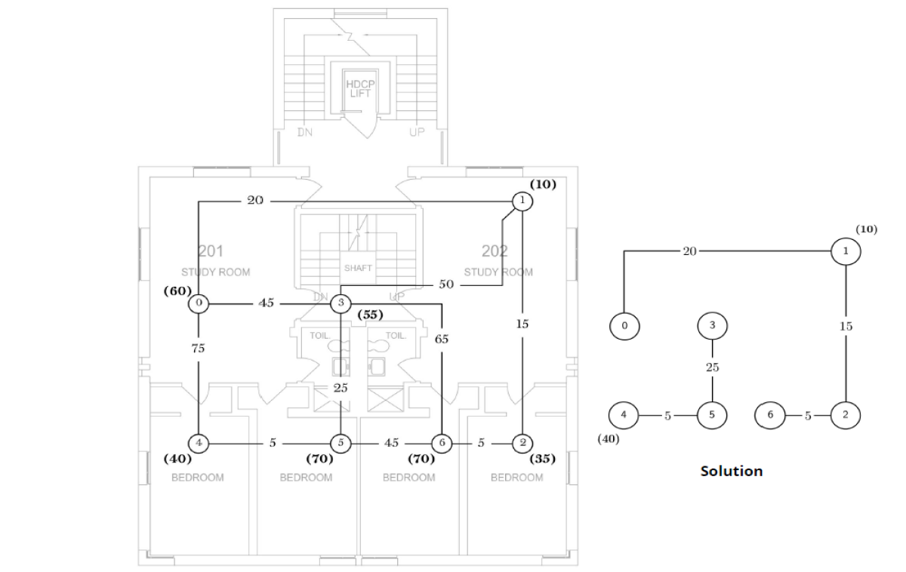
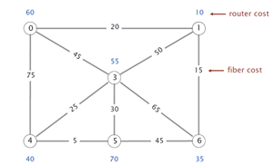
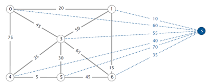

# 第7、8周上机试题

## A 去火车站

分数 10
作者 朱允刚
单位 吉林大学
寒假到了，小明准备坐火车回老家，现在他从学校出发去火车站，CC市去火车站有两种方式：轻轨和公交车。小明为了省钱，准备主要以乘坐公交为主。CC市还有一项优惠政策，持学生证可以免费乘坐一站轻轨（但只能乘坐一站）。小明想尽快到达火车站，请编写程序为小明找到一条从学校到火车站最快的路线及换乘轻轨的方案。

假设换乘时间忽略不计，公交车与轻轨站点相同，但线路和速度不一定相同，所有线路都是双向的。可以第一站就乘坐轻轨，也可以最后一站乘坐轻轨，也可以在中间某站坐轻轨。如果乘坐轻轨和不乘坐轻轨到达火车站的时间相同，则无需换乘轻轨。最多坐一站轻轨。

输入格式:
输入包含多组数据。每组数据第一行为3个整数n、s和t，分别表示车站数（编号为1至n），小明学校所在的站和火车站所在的站。下一行为一个整数m，表示公交车的线路信息，接下来m行，每行为3个正整数a、b、c，表示公交车从a站到b站需要c分钟。下一行为一个整数k，表示轻轨的线路信息，接下来k行，每行为3个正整数x、y、z，表示轻轨从x站到y站需要z分钟。所有整数均不超过20000。

输出格式:
对每组数据输出2行。第1行为1个整数T，表示从学校到达火车站的最短时间；第2行为一个整数K，表示在站点K换乘轻轨，若有多个可能的换乘点，则输出编号最小者，如果无需换乘轻轨，则第二行输出“no metro”。

输入样例:

```data
4 1 4
4
1 2 2
1 3 3
2 4 4
3 4 5
1
2 4 3
4 1 4
4
1 2 2
1 3 3
2 4 4
3 4 5
1
2 4 3
```

输出样例:

```data
5
2
5
2
```

代码长度限制
16 KB
时间限制
1000 ms
内存限制
20 MB
栈限制
8192 KB

题解

```cpp
#include <iostream>
#include <cstdio>
#include <cstring>
#include <algorithm>
#include <queue>
using namespace std;
// #define Test
struct Edge
{
    int to, Nxt, w;
};
struct P{
    int idx, w;
    bool operator < (const P& x) const{
        return x.w < this->w;
    }
};
const int N = 2e4 + 10, INF = 0x3f3f3f3f;
int n, Head[N], vis[N], dis[N], idx;
int SpeHead[N], FinalDis[N], Speidx;
Edge e[N * 2], spe[N * 2];
void AddEdge(int u, int v, int w, int& idx, Edge e[], int head[]);
int Dijkstra(int s, int t, int vis[], int dis[], int head[], Edge e[]);
int main(){
    #ifdef Test
        freopen("file.in", "r", stdin);
        freopen("file.out", "w", stdout);
    #endif
    int s, t;
    while (scanf("%d%d%d", &n, &s, &t) != EOF)
    {
        memset(Head, -1, sizeof(Head));
        memset(SpeHead, -1, sizeof(SpeHead));
        idx = Speidx = 0;
        int m;
        scanf("%d", &m);
        for(int i = 1;i <= m;i ++){
            int u, v, w;
            scanf("%d%d%d", &u, &v, &w);
            AddEdge(u, v, w, idx, e, Head);
            AddEdge(v, u, w, idx, e, Head);
        }
        Dijkstra(s, t, vis, dis, Head, e);
        Dijkstra(t, s, vis, FinalDis, Head, e);
        int k; scanf("%d", &k);
        for(int i = 1;i <= k;i ++){
            int u, v, w;
            scanf("%d%d%d", &u, &v, &w);
            AddEdge(u, v, w, Speidx, spe, SpeHead);
            AddEdge(v, u, w, Speidx, spe, SpeHead);
        }
        int ans = dis[t], Ischage = 0, StartChange = 0;
        for(int i = 1;i <= n;i ++){
            for(int j = SpeHead[i];j != -1;j = spe[j].Nxt){
                int v = spe[j].to;
                if(dis[i] + spe[j].w + FinalDis[v] < ans){
                    Ischage = 1;
                    ans = dis[i] + spe[j].w + FinalDis[v];
                    StartChange = i; 
                }
            }
        }
        printf("%d\n", ans);
        if(Ischage)
            printf("%d\n", StartChange);
        else printf("no metro\n");
    }
    return 0;
}
void AddEdge(int u, int v, int w, int& idx, Edge e[], int head[]){
    e[idx].to = v;
    e[idx].Nxt = head[u];
    e[idx].w = w;
    head[u] = idx ++;
}
int Dijkstra(int s, int t, int vis[], int dis[], int head[], Edge e[]){
    for(int i = 1;i <= n;i ++) 
        dis[i] = INF, vis[i] = 0;
    dis[s] = 0;
    priority_queue<P> pq;
    pq.push(P{s, dis[s]});
    for(int i = 1;i <= n;i ++){
        P tmp = pq.top(); pq.pop();
        int u = tmp.idx;
        if(!vis[u]){
            vis[u] = 1;
            for(int j = head[u];j != -1;j = e[j].Nxt){
                int v = e[j].to;
                if(!vis[v] && dis[v] > dis[u] + e[j].w){
                    dis[v] = dis[u] + e[j].w;
                }
                if(!vis[v]) pq.push(P{v, dis[v]});
            }
        }
    }
    return dis[t];
}
```

## B 联盟数目

分数 10
作者 朱允刚
单位 吉林大学
艾迪是一家集团公司的老板，该集团包含n家公司，为了管理公司，艾迪会时常通过网络向各公司发送消息。各公司间的网络是单向的，每个公司都有一个分发列表，表示其能向哪些公司直接传达消息。例如A公司的分发列表为B、C，表示A可将消息直接传送给B和C（由于网络是单向的，B或C不一定能向A传送消息），这样艾迪若想向A、B、C公司发送消息，则只需向A发送消息即可，随后A可将消息传送到B和C。

为了便于管理各公司，艾迪打算将n家公司分成若干组，每组称为一个区域联盟，每组满足如下条件：组内的任意公司消息互相可达。即对于组内任意公司u和v，u可将消息传送到v（可由u直接传送到v，也可通过组内其他公司中转传送到v），v也可将消息传送到u。可以认为一个公司可以将消息传送给自己，即一个公司可以自成一组。

艾迪希望组的数量尽可能少，即在满足上述条件的情况下，每组包含的公司数目尽可能多。

现给定每个公司的分发列表，请编写程序告知艾迪，他的集团最少能分成多少组。

输入格式:
第一行包含一个整数T (1≤T≤100)表示数据组数。对于每组数据，第一行为一个整数n (2≤n≤100)，表示公司数目，公司编号为1到n。随后n行，第i行包含若干整数，表示第i个公司的分发列表，每行以0结尾。

输出格式:
对于每组数据，输出一行，为一个整数，表示组数。

输入样例:

```data
3
5
2 4 3 0
4 5 0
0
0
1 0
3
2 0
0
2 1 0
3
2 0
3 0
0
```

输出样例:

```data
3
3
3
```

代码长度限制
16 KB
时间限制
100 ms
内存限制
64 MB
栈限制
8192 KB

题解

```cpp
#include <iostream>
#include <cstdio>
#include <cstring>
#include <vector>
#include <algorithm>

using namespace std;
//#define Test
int n;
void Dfs(vector<vector<int>>& graph, vector<int>& vis, int u);
void Solve(vector<vector<int>>& graph, vector<int>& vis);
void NewDfs(vector<vector<int>>& graph, vector<int>& vis, int u);
bool EnableBack(int u, vector<vector<int>>& graph, int aim);
int main(){
    #ifdef Test
        freopen("file.in", "r", stdin);
        freopen("file.out", "w", stdout);
    #endif
    int T;
    cin >> T;
    for(int i = 1;i <= T;i ++){
        scanf("%d", &n);
        vector<vector<int>> Graph(n + 1, vector<int>(n + 1, 0));
        vector<int> vis(n + 1, 0);
        for(int i = 1;i <= n;i ++){
            int to;
            do
            {
                scanf("%d", &to);
                if(to) Graph[i][to] = 1;
            } while (to);
            Graph[i][i] = 1;
        }
        Solve(Graph, vis);
    }
    return 0;
}
void NewDfs(vector<vector<int>>& graph, vector<int>& vis, int u){
    vis[u] = 1;
    for(int i = 1;i <= n;i ++){
        if(!vis[i] && i != u && graph[u][i]){
            NewDfs(graph, vis, i);
        }
    }
}
bool EnableBack(int u, vector<vector<int>>& graph, int aim){
    vector<int> vis(n + 1, 0);
    NewDfs(graph, vis, u);
    return vis[aim] == 1;
}
void Dfs(vector<vector<int>>& graph, vector<int>& vis, int u){
    vis[u] = 1;
    vector<int> can(n + 1, 0);
    NewDfs(graph, can, u);
    for(int i = 1;i <= n;i ++){
        
        if(i != u && !vis[i] && can[i]){
            if(EnableBack(i, graph, u)) vis[i] = 1;
        }
    }
}
void Solve(vector<vector<int>>& graph, vector<int>& vis){
    int cnt = 0;
    for(int i = 1;i <= n;i ++){
        if(!vis[i]){
            Dfs(graph, vis, i);
            cnt ++;
        }
    }
    printf("%d\n", cnt);
}
```

## C 社交网络

分数 10
作者 朱允刚
单位 吉林大学
可以将n个QQ用户间的好友关系建模为一个包含n个顶点的无向图，顶点编号为1至n，每个顶点对应一个用户，若2个用户i和j是QQ好友，则在顶点i和j之间连接一条边，并根据用户间的亲密度对该边附以一个权值$c_{ij}$
?
 。在该图中，可以利用两个顶点间的最短路径长度衡量两个用户的关系密切程度，也可以利用经过一个顶点的最短路径数目来衡量一个用户在关系网络中的影响力，具体地，我们定义用户k在QQ关系网络中的“影响力”为：


其中$N_{ij}$为顶点i到j的最短路径数目，$N_{ijk}$为顶点i到j的所有最短路径中经过顶点k的最短路径数目（上述二值可能超出int型范围，请使用long long类型）。$D_{ij}$表示i到j的最短路径长度。

现给定一个如上描述的无向图，请编写程序，计算每个顶点的“影响力”，假定给定的图是连通的。

输入格式:
输入第一行为两个正整数n和e，分别表示图的顶点数和边数，接下来e行表示每条边的信息，每行为3个正整数a、b、c，其中a和b表示该边的端点编号，c表示权值。各边并非按端点编号顺序排列。

n≤100，e≤5000，c≤1000，任意两点间的最短路径数目≤$10^{10}$

输出格式:
输出为n行，每行一个实数，精确到小数点后3位，第i行为顶点i的影响力。

输入样例:

```data
4 4
3 2 6
4 3 1
1 3 9
4 1 1
```

输出样例:

```data
0.000
0.000
30.000
20.000
```

解释:
对于顶点1：边2-3、3-4、2-4的最短路径均不经过顶点1，故顶点1的影响力为0.

对于顶点3：
顶点1到2的最短路径共1条，长度为8，经过点3，顶点2到4的最短路径共1条，长度为7，经过点3，顶点1到4的最短路径共1条，但不经过点3。
故$$f(3)=D_{12}?1+D_{24}?1+D_{14}?0+D_{21}?1+D_{42}?1+D_{41}?0=8+7+0+8+7+0=30.000$$

提示:
若顶点a到顶点b有x条路径，点b到点c有y条路径，则a经过b到达c的路径有$x\times y$条。

代码长度限制
16 KB
时间限制
50 ms
内存限制
64 MB
栈限制
8192 KB

题解

```cpp
#include <iostream>
#include <cstdio>
#include <cstring>
#include <algorithm>
using namespace std;
//#define Test
struct Edge{
    int to, Nxt, w;
};
const int N = 1e2 + 10, M = 1e4 + 10, INF = 0x3f3f3f3f;
Edge e[M];
typedef long long ll;
int Head[N], idx, vis[N], PreDis[N], n, m, D[N][N];
double f[N];
long long Num_ij[N][N], Cnt[N];
int FindMin(int* dis);
void AddEdge(int u, int v, int w);
void Dijkstra(int u, int v, int* dis);
int main(){
    #ifdef Test
        freopen("file.in", "r", stdin);
        freopen("file.out", "w", stdout);
    #endif
    scanf("%d%d", &n, &m);
    memset(Head, -1, sizeof(Head));
    for(int i = 1;i <= m;i ++){
        int u, v, w;
        scanf("%d%d%d", &u, &v, &w);
        AddEdge(u, v, w);
        AddEdge(v, u, w);
    }
    for(int i = 1;i <= n;i ++){
        for(int j = 1;j <= n;j ++){
            if(i >= j) continue;
            memset(vis, 0, sizeof(vis));
            if(!D[i][j])
            Dijkstra(i, j, PreDis);
        }
    }
    for(int k = 1;k <= n;k ++){
        for(int i = 1;i <= n;i ++){
            for(int j = 1;j <= n;j ++){
                if(i == k || j == k || i >= j) continue;
                ll tmp = Num_ij[i][k] * Num_ij[k][j];
                if(D[i][k] + D[k][j] != D[i][j]) tmp = 0;
                f[k] += (tmp * 1.0) / (Num_ij[i][j] * 1.0) * (1.0 * D[i][j]);
                // printf("%d %d : %d\n", i, j, Num_ij[i][j]);
            }
        }
    }
    for(int i = 1;i <= n;i ++){
        printf("%.3lf\n", f[i] * 2);
    }
    return 0;
}
void AddEdge(int u, int v, int w){
    e[idx].to = v;
    e[idx].w = w;
    e[idx].Nxt = Head[u];
    Head[u] = idx ++;
}
void Dijkstra(int u, int v, int* dis){
    for(int i = 1;i <= n;i ++) dis[i] = INF;
    dis[u] = 0;
    memset(Cnt, 0, sizeof(Cnt));
    Cnt[u] = 1;
    for(int i = 1;i <= n;i ++){
        int st = FindMin(dis);
        if(st == -1) break;
        vis[st] = 1;
        D[st][u] = D[u][st] = dis[st];
        Num_ij[st][u] = Num_ij[u][st] = Cnt[st];
        for(int j = Head[st];j != -1;j = e[j].Nxt){
            int fin = e[j].to;
            if(!vis[fin] && dis[fin] > dis[st] + e[j].w){
                dis[fin] = dis[st] + e[j].w;
                Cnt[fin] = Cnt[st];
            } else if(!vis[fin] && dis[fin] == dis[st] + e[j].w){
                Cnt[fin] += Cnt[st];
            }
        }
    }
    D[v][u] = D[u][v] = dis[v];
    // printf("%d %d : %d\n", u, v, D[u][v]);
    Num_ij[v][u] = Num_ij[u][v] = Cnt[v];
}
int FindMin(int* dis){
    int res = -1, Min = INF;
    for(int i = 1;i <= n;i ++){
        if(!vis[i] && dis[i] < Min){
            Min = dis[i];
            res = i;
        }
    }
    return res;
}
```

## D 快速排序

分数 10
作者 朱允刚
单位 吉林大学
给定包含n个元素的整型数组a[1],a[2],...,a[n]，利用快速排序算法对其进行递增排序，请输出排序过程，即每次Partition之后的数组。最后输出排序后的数组。每次选择所处理的子数组的第一个元素作为基准元素。

输入格式:
输入为两行，第一行为一个整数n（1<n≤1000），表示数组长度。第二行为n个空格间隔的整数，表示待排序的数组。

输出格式:
输出为若干行，每行依次输出Partition后的整个数组，每个元素后一个空格。最后一行输出排序后的数组。

输入样例:

```data
5
4 5 3 2 1
```

输出样例:

```data
2 1 3 4 5 
1 2 3 4 5 
1 2 3 4 5 
```

提示:
就是在每次调用完Partition函数后输出R[1]….R[n]。其余与快速排序一致。

代码长度限制
16 KB
时间限制
150 ms
内存限制
64 MB
栈限制
8192 KB

题解

```cpp
#include <iostream>
#include <cstdio>
#include <cstring>
using namespace std;
// #define Test
const int N = 1e3 + 10;
int a[N], arr_size;
void QuickSort(int m, int n);
int Partition(int m, int n);
void PrintArr();
int main(){
    #ifdef Test
        freopen("file.in", "r", stdin);
        freopen("file.out", "w", stdout);
    #endif
    scanf("%d", &arr_size);
    for(int i = 1;i <= arr_size;i ++){
        scanf("%d", &a[i]);
    }
    QuickSort(1, arr_size);
    PrintArr();
    return 0;
}
void PrintArr(){
    for(int i = 1;i <= arr_size;i ++){
        printf("%d ", a[i]);
    }
    puts("");
}
void QuickSort(int m, int n){
    if(m >= n) return ;
    int index = Partition(m, n);
    // printf("m is %d Index is %d\n", m, index);
    // if(m != index)
        PrintArr();
    QuickSort(m, index - 1);
    QuickSort(index + 1, n);
}
int Partition(int m, int n){
    int k = a[m], i = m + 1, j = n;
    while (i <= j)
    {
        while(i <= n && a[i] <= k) i ++;
        while(j > m && a[j] > k) -- j;
        if(i < j){
            swap(a[i], a[j]);
            i ++; j --;
        }    
    }
    swap(a[m], a[j]);
    return j;
}
```

## E 网络布线

分数 10
作者 朱允刚
单位 吉林大学

亚洲杯赛期间需要保证运动员公寓网络畅通，以使运动员都能正常上网。

假定公寓楼内有n个房间，编号为0…n?1，每个房间都需要网络连接。房间 i 有网络，当且仅当满足如下2个条件之一：

（1）房间 i 安装了路由器（成本为 $r_i$>0）

（2）房间 i 和房间 j 有网线连接且房间 j 有网络（在房间 i 和房间 j 之间布置网线的成本为 $f_{ij}$>0）

假定你是赛事组委会的网络工程师，请编写程序设计一个网络布线方案（哪些房间安装路由器，哪些房间之间布置网线），使得所有房间都有网络，且总成本最小。

例如下图包含7个房间和10个可能的连接，安装路由器的成本为括号内数字，房间之间布置网线的成本为边的权值。其解决方案为右下图，即在房间1和4安装路由器，并进行图中的网线布置。总成本为120。



输入格式:
输入第一行为两个正整数n和e；n为房间数，不超过600；e为可能的连接数，不超过$2×10^5$。接下来一行为n个空格间隔的正整数，第i个整数(i≥0)表示在房间i安装路由器的成本。接下来e行，每行为3个非负整数i、j、f，表示在房间i和房间j之间布置网线的成本为f。

输出格式:
输出为一个整数，表示最优网络布线方案的成本。

输入样例:

```data
7 10
60 10 35 55 40 70 70
0 1 20
0 4 75
0 3 45
1 3 50
1 2 15
2 6 5
5 6 45
4 5 5
3 5 25
3 6 65
```

输出样例:

```data
120
```

提示:
可引入一个虚拟顶点，将该顶点与其他所有顶点用边相连，边权等于那些顶点的权值。进而形成一个新图，对新图求最小支撑树。注意本题顶点编号从0开始。




代码长度限制
16 KB
时间限制
60 ms
内存限制
64 MB
栈限制
8192 KB

题解

```cpp
#include <iostream>
#include <cstdio>
#include <cstring>
#include <algorithm>
using namespace std;
// #define Test
const int N = 610, M = 2e5 + 10;
struct Edge{
    int a, b, w;
};
int Father[N], cost[N], vis[N], Rank[N], n, m, idx;
Edge e[M * 2];
void AddEdge(int u, int v, int w);
void Init(int n);
int FindFather(int x);
void Union(int x, int y);
int Kruskal();
bool Cmp(Edge x, Edge y);
int main(){
    #ifdef Test
        freopen("file.in", "r", stdin);
        freopen("file.out", "w", stdout);
    #endif
    scanf("%d%d", &n, &m);
    Init(n);
    for(int i = 0;i < n;i ++){
        scanf("%d", &cost[i]);
        AddEdge(i, n, cost[i]);
    }
    for(int i = 0;i < m;i ++){
        int u, v, w;
        scanf("%d%d%d", &u, &v, &w);
        AddEdge(u, v, w);
    }
    int ans = Kruskal();
    printf("%d\n", ans);
    return 0;
}
void AddEdge(int u, int v, int w){
    e[idx].a = u;
    e[idx].b = v;
    e[idx].w = w;
    idx ++;
}
void Init(int n){
    for(int i = 0;i <= n;i ++)
        Father[i] = i;
}
int FindFather(int x){
    if(Father[x] == x) return x;
    Father[x] = FindFather(Father[x]);
    return Father[x];
}
void Union(int x, int y){
    int fx = FindFather(x), fy = FindFather(y);
    if(fx == fy) return ;
    if(Rank[fx] > Rank[fy]){
        Father[fy] = fx;
    } else {
        if(Rank[fx] == Rank[fy]){
            Rank[fy] ++;
        }
        Father[fx] = fy;
    }
}
bool Cmp(Edge x, Edge y){
    return x.w < y.w;
}
int Kruskal(){
    sort(e, e + idx, Cmp);
    int ans = 0;
    for(int i = 0;i < idx;i ++){
        int u = e[i].a, v= e[i].b, w = e[i].w;
        if(FindFather(u) == FindFather(v)) continue;
        ans += w;
        Union(u, v);
    }
    return ans;
}
```

## F 最大边

分数 10
作者 朱允刚
单位 吉林大学
给定一个包含n个顶点的无向正权连通图，顶点编号为1到n。请编写程序计算其最小支撑树中任意两个顶点间路径中，权值最大的边的权值。

输入格式:
第一行为2个正整数n和m，n为图中顶点个数，m为边的条数。接下来m行，每行3个整数a、b、c，表示顶点a和顶点b之间有一条权值为c的边。随后一行为一个正整数T，表示查询数目。接下来T行，每行2个整数a和b，表示查询最小支撑树中顶点a和b间路径中的最大边。n≤2000，m≤30000，1 ≤a,b≤n且$a\not = b$，c  ≤65535，T  ≤ 1000 。

输出格式:
对于每个查询输出一行，为1个整数，表示最小支撑树两个顶点间的路径中的最大边的权值。

输入样例:

```data
8 20
2 7 44181
1 2 36877
3 6 2506
2 8 46829
7 1 2843
4 5 40699
1 3 15911
7 6 15553
5 6 22541
8 6 62008
3 4 62009
5 7 53337
5 3 12157
4 6 10112
1 5 22574
3 7 28993
4 7 53536
6 1 951
4 2 31411
7 8 31020
10
7 5
5 4
4 2
7 2
3 4
1 5
1 5
7 3
6 1
4 1
```

输出样例:

```data
12157
12157
31411
31411
10112
12157
12157
2843
951
10112
```

代码长度限制
16 KB
时间限制
200 ms
内存限制
512 MB
栈限制
131072 KB

题解

```cpp
#include <iostream>
#include <cstdio>
#include <queue>
#include <cstring>
#include <vector>
using namespace std;
// #define Test
struct Edge
{
    int to, Nxt, w;
};
struct P{
    int idx, w;
    bool operator < (const P& x) const{
        return x.w < this->w;
    }
};
const int N = 2e3 + 10, INF = 0x3f3f3f3f, M = 3e4 + 10;
int n, Head[N], vis[N], dis[N], idx, pre[N];
Edge e[M * 2];
void AddEdge(int u, int v, int w, int& idx, Edge e[], int head[]);
void Dijkstra(int s, int t, int vis[], int dis[], int head[], Edge e[]);
void PrintPath(int u);
int FindMaxAns(int x, int y);
void GetPathNode(vector<int>& a, int u);
int main(){
    #ifdef Test
        freopen("file.in", "r", stdin);
        freopen("file.out", "w", stdout);
    #endif
    memset(Head, -1, sizeof(Head));
    memset(pre, -1, sizeof(pre));
    int m;
    scanf("%d%d", &n, &m);
    for(int i = 1;i <= m;i ++){
        int a, b, c;
        scanf("%d%d%d", &a, &b, &c);
        AddEdge(a, b, c, idx, e, Head);
        AddEdge(b, a, c, idx, e, Head);
    }
    Dijkstra(1, n, vis, dis, Head, e);
    int t;
    scanf("%d", &t);
    for(int i = 1;i <= t;i ++){
        int x, y;
        scanf("%d%d", &x, &y);
        int ans = FindMaxAns(x, y);
        printf("%d\n", ans);
    }
    // PrintPath(4);
    // PrintPath(2);
    return 0;
}
void GetPathNode(vector<int>& a, int u){
    for(int i = u;i != -1;i = pre[i])
        a.push_back(i);
}
int FindMaxAns(int x, int y){
    vector<int> PathOfx;
    GetPathNode(PathOfx, x);
    vector<int> PathOfy;
    GetPathNode(PathOfy, y);
    int LastSameNode = 0, MaxNum = 0;
    for(int i = PathOfx.size() - 1, j = PathOfy.size() - 1;i >= 0 && j >= 0;){
        if(PathOfx[i] == PathOfy[j]){
            LastSameNode = PathOfx[i];
            i --; j --;
        } else break;
    }
    for(int i = x;i != LastSameNode;i = pre[i]){
        MaxNum = max(MaxNum, dis[i]);
    }
    for(int i = y;i != LastSameNode;i = pre[i]){
        MaxNum = max(MaxNum, dis[i]);
    }
    return MaxNum;
}
void PrintPath(int u){
    vector<int> tmp;
    for(int i = u;i != -1;i = pre[i])
        tmp.push_back(i);
    int n = tmp.size();
    for(int i = 0;i < n;i ++){
        printf("->%d", tmp[i]);
    }
    puts("");
}
void AddEdge(int u, int v, int w, int& idx, Edge e[], int head[]){
    e[idx].to = v;
    e[idx].Nxt = head[u];
    e[idx].w = w;
    head[u] = idx ++;
}
void Dijkstra(int s, int t, int vis[], int dis[], int head[], Edge e[]){
    for(int i = 1;i <= n;i ++) 
        dis[i] = INF, vis[i] = 0;
    dis[s] = 0;
    priority_queue<P> pq;
    pq.push(P{s, 0});
    int MaxNum = 0;
    while(!pq.empty()){
        P tmp = pq.top(); pq.pop();
        int u = tmp.idx;
        if(!vis[u]){
            vis[u] = 1;
            for(int j = head[u];j != -1;j = e[j].Nxt){
                int v = e[j].to;
                if(!vis[v] && dis[v] > e[j].w){
                    dis[v] = e[j].w;
                    pre[v] = u;
                }
                if(!vis[v]) pq.push(P{v, dis[v]});
            }
        }
    }
}
```
