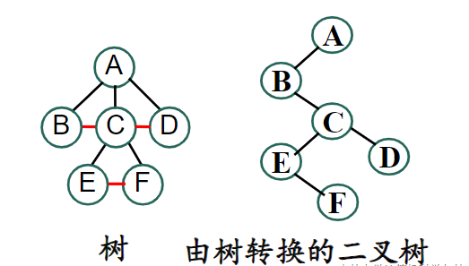

# 2024年秋季 数据结构课程笔记

## Lecture 10 树的存储和操作

### 树与二叉树的转换

#### 树转换为二叉树


结论：

1. 一个节点的左孩子还是该节点的左孩子
2. 一个节点的右兄弟变成该节点的右孩子
3. 根节点没有右孩子

#### 二叉树转换为树

若二叉树的**右子树为空**，则可以转换为一棵树
将所有节点的右节点与最近的父节点相连，然后把所有原有的父节点和右孩子的连线删掉
得出结论：**一个节点的左孩子不变，它的右孩子变成它的兄弟**

#### 二叉树转换为森林

若二叉树的**右子树不空**，则可以转换为森林
将根节点和其右子树的连线删去，然后将每个得到的新的二叉树转换为树或者森林

由此有以下结论
任意一片森林都对应一棵二叉树
任意一棵二叉树都对应**唯一的**一片森林

### 树的存储结构

双亲表示法不好确定一个节点的孩子是谁，得遍历整棵树
孩子表示法不好确定一个节点的父亲是谁，而且空间浪费巨大

#### 树的先根序列和节点度表示法

定理：**已知一个树的先根序列和对应的度序列，可以唯一确定一棵树**

#### 树 & 中根序列

很显然，树**没有**中根序列，因为一个节点可能不止有两个孩子

#### 树的后根序列和节点度表示法

对于给定的后根节点序列和对应度序列，若节点$X$的度为$k$，则选取序列中恰在$X$之前的$k$个树作为$X$的子树

#### 树的层次序列和节点度表示法

这个很显然，可以唯一确定一棵树

#### 总结

**遍历序列+度序列**未保存指针，节省了空间，但是不便于访问。
适合用于树的压缩存储和构建，作为树的输入输出

#### 树的链接存储结构

**左孩子-右孩子**链接结构和二叉树完全一致，可以以二叉树的操作方式去操作树

### 树和森林的遍历

森林的先根序列和其对应的二叉树的先根序列相同
森林的后根序列与其对应的二叉树的**中根序列**相同

如下为相应的对树和森林的一些操作的算法

#### 对树的先根遍历

算法对应代码如下

```cpp
void PreOrderVisit(TreeNode* root){
    if(!root) return;
    Visit(root);
    for(p = root->FistChild;p;p = p->NextBrother){
        Visit(p);
    }
}  
```

#### 在以$root$为根的树中寻找以$target$为值的节点

实际上还是递归寻找的思想，寻找子树中有没有对应节点

```cpp
TreeNode* FindTarget(TreeNode* root, int target){
    if(!root) return nullptr;
    if(root->data == target) return root;
    for(TreeNode* p = root->FirstChild;p;p = p->NextBrother){
        TreeNode* ans = FindTarget(p, target);
        if(ans) return ans;
    }
    return nullptr;
}
```

#### 在以$root$为根的树中寻找$p$的父节点

本质上还是递归的思想，这种非工程的对树和森林的操作，使用递归的场景非常多

```cpp
TreeNode* FindFather(TreeNode* root, TreeNode* p){
    if(!root || root == p || !p) return nullptr;
    for(TreeNode* chd = root->FirstChild;chd;chd = chd->NextBrother){
        if(chd == p) return root;
        TreeNode* ans = FindFather(chd, p);
        if(ans) return ans;
    }
    return nullptr;
}
```

注意以上代码中的一个细节，那就是$p == nullptr$时候的情况，当$p$为空时，根本没法确定它的父节点是谁，这种情况一定要注意！！！

#### 释放以$p$为根的子树

```cpp
void Del(TreeNode* p){
    if(!p) return;
    for(TreeNode* chd = p->FirstChild;chd;){
        TreeNode* Nex = chd->NextBrother;
        Del(chd);
        chd = Nex;
    }
    delete p;
    p = nullptr;
}
```

#### 在以$root$为根的树中删除以$p$为根的子树

```cpp
void DeleteSubTree(TreeNode* root, TreeNode* p){
    if(!root || !p) return;
    if(root == p){Del(p), return;}
    TreeNode* fa = FindFather(root, p);
    if(fa->FirstChild == p){
        fa->FirstChild = p->NextBrother;
        Del(p);
        return;
    }
    TreeNode* Pre = fa->FirstChild;
    while(Pre->NextBrother != p){
        pre = pre->NextBrother
    }
    Pre->NextBrother = p->NextBrother;
    Del(p);
}
```

这个算法的实现并非想象的那么简单，实际上，根的孩子们中并不一定有$p$，所以实际上先要调用函数获得$p$的父亲节点，然后对$p$的父节点的子节点们进行操作

实际上删除$p$节点对应的子树和$root$为什么有关系？理论上我们删除$p$为根节点的子树不就完事了？**关键是我们要把$p$的父节点指向空！不然会出现内存泄漏**！！！这就是一个很要命的问题

#### 树和森林的层次遍历

无论是树，还是森林，同层次的节点依次访问

## Lecture 11 树和二叉树的应用

### 压缩与$Huffman$树

#### 信息编码

对于**不等长**编码，可能会带来**解码**的歧义问题

#### 扩充二叉树

在空指针位置，增加空叶节点，由此产生二叉树称为**扩充二叉树**

非空叶节点称为内节点，空叶节点称为外节点
每个内节点有两个孩子，每个外节点没有孩子
规定空二叉树的扩充二叉树只有一个外节点

#### 加权路径长度 (*Weighted Path Length*)即$WPL$

记扩充二叉树有$n$个外节点，第$i$个外节点的权值（注意这个权值是赋给它的）为$w_i$，**深度**为$L_i$，则有$$\displaystyle WPL = \sum_{i = 1}^{n}w_i\times L_i$$
将$WPL$值最小者称为**最优二叉树**

实际上，最优编码问题可以转化为构造最优二叉树问题

换句话说，文件中字符$a_i$的编码长度即构造最优二叉树中字符对应外节点的**深度**$L_i$

#### *Shannon-Fano*算法

自顶向下建树，循环将字符集分为频率相近的两部分

#### *Huffman*算法

重复做如下过程，直到节点序列只剩一个元素：
选取权值最小的两个节点，权值相加作为新节点，原来两个节点抛出节点序列，新的节点作为原来两个节点的父亲。加入节点序列

建成树后，连接左孩子的路径标0，连接右孩子的路径标1。由此，根节点到叶节点的路径序列作为该叶节点的编码序列

很显然存在如下结论
**$Huffman$编码是无前缀冲突编码**

文件存储所需空间为**总编码长度**
P34选择$B$

##### 二子性

$Haffman$树中不包含度为$1$的点（二子性）

##### 同权不同构

$Haffman$树形态不唯一，编码不唯一
但是！最小编码长度唯一，$WPL$恒定

#### $Huffman$算法实现

```cpp
struct HaffmanNode{
    char data;
    int weight;
    HaffmanNode* left, *right;
}

class Solution{
public:
    HaffmanNode* CreateHaffmanTree(HaffmanNode* H[], int n){
        for(int i = 0;i < n;i ++){
            scanf("%d%c", &H[i]->weight, &H[i]->weight);
            H[i]->left = H[i]->right = nullptr;
        }
        sort(H, H + n, ComPare);
        for(int i = 0;i < n - 1;i ++){
            HaffmanNode* tmp = new HaffmanNode();
            tmp->weight = H[i]->weight + H[i + 1]->weight;
            tmp->left = H[i]; tmp->right = H[i + 1];
            int j = i + 2;
            while (j < n && H[j]->weight < tmp->weight)
            {
                H[j - 1] = H[j]; // 记得要把元素左移！
                j ++;
            }
            H[j - 1] = tmp;
        }
        return H[n - 1];
    }
    bool ComPare(HaffmanNode* a, HaffmanNode* b){
        return a->weight < b->weight;
    }
private:
    int WPL = 0;
};
```

时间复杂度为$O(n^2)$

#### $Huffman$算法的证明

数学归纳法：
显然对于节点个数$n = 2$时成立
对于节点个数$n - 1$成立（实际上是把n个点中的最小的两个元素合并成一个元素），那么选取其中的最小值（$n-1$时），不难证明将其分为二叉树，仍然有$WPL_{min}$

进而可以证明重要结论：
>$\displaystyle WPL_{min}^n = WPL_{min}^{n-1} + w_1 + w_2$

#### $Huffman$算法与贪心算法

实际上$Huffman$算法采用了每步都选择最优的算法，最终也满足了全局最优，实际上是成功的贪心算法的实现

### 表达式树

#### 相关定义

表达式树，非叶结点为运算符，叶节点为操作数

表达式树的**中根序列**为中缀表达式，**后根序列**为后缀表达式

#### 根据后缀表达式构造表达式二叉树

算法的思路是由后根序列的构造顺序逆推，算法对应代码如下

```cpp
TreeNode* BuildExp(char* s){
        int len = strlen(s);
        stack<TreeNode*> stk;
        for(int i = 0;i < len;i ++){
            TreeNode* node = new TreeNode(s[i]);
            if(!isalpha(s[i])){
                node->left = stk.top(); stk.pop();
                node->right = stk.top(); stk.pop();
            }
            stk.push(node);
        }
        return stk.top();
    }
```

#### 根据中缀表达式直接转换为表达式树

中缀表达式就是原始的那个式子
这个有点类似中缀表达式求值，不同的是，求值是对数值进行操作，而这边是进行构建二叉树的操作

#### 计算表达式二叉树对应值

实际上采用了递归的思想
算法对应代码如下

```cpp
int CalculateExpTree(TreeNode* root){
        if(!root) return 0;
        if(!root->left && !root->right) return root->val - '0';
        int ansL = CalculateExpTree(root->left);
        int ansR = CalculateExpTree(root->right);
        char ch = root->val;
        switch (ch)
        {
        case '+':
            return ansL + ansR;
            break;
        case '-':
            return ansL - ansR;
            break;
        case '*':
            return ansL * ansR;
            break;
        case '/':
            return ansL / ansR;
            break;
        default:
            break;
        }
    }
```

### 并查集

#### 定义

将$n$个元素分为一组不相交的集合
将维护该不相交集合的数据结构称为**并查集**
选取集合中的某个元素代表整个集合，称为该集合的代表元

#### 并查集的实现

并查集的一种实现通过树。而且这种树是向上访问的
于是我们采用$Father[i]$来存储并查集

相应算法实现代码如下

```cpp
class Solution{
public:
    void MakeSet(int x){
        Father[x] = 0;
    }
    int FindFather(int x){
        if(Father[x] == 0) return x;
        Father[x] = FindFather(Father[x]);
        return Father[x];
    }
    void Union(int x, int y){
        Father[FindFather(y)] = FindFather(x); // 注意此处x也要找到父节点！！！
    }
private:
    int Father[N] = {0};
};
```

#### 对于并查集的优化

##### 路径压缩

将寻找根节点中的递归进行优化
对应如下

```cpp
int FindFather(int x){
    if(Father[x] == 0) return x;
    Father[x] = FindFather(Father[x]);
    return Father[x];
}
```

##### 按秩合并

为了将子树合并时，能够使得树不是太高。也就是为了构成多叉树而不是单链

对于秩的操作的注意点：树高增加时更新秩。**树高减小时秩不变！！！**

对于秩的存储，实际上可以利用$Father[]$进行存储，非根节点存储该节点对应根节点下标，根节点存储**相应秩的负数**

优化后的代码如下

```cpp
class Solution{
public:
    void MakeSet(int x){
        Father[x] = 0;
    }
    int FindFather(int x){
        if(Father[x] <= 0) return x;
        Father[x] = FindFather(Father[x]);
        return Father[x];
    }
    void Union(int x, int y){
        int fx = FindFather(x), fy = FindFather(y);
        if(fx == fy) return ;// 特别注意这一行！！！
        // 注意此处 Father[fx]和Father[fy]都是负数 也就是说，如果 Father[fx] > Father[fy] 那么实际上是fy的树高
        if(Father[fx] > Father[fy]){
            Father[fx] = fy;
        } else{
            if(Father[fx] == Father[fy]) Father[fx] --;
            Father[fy] = fx;
        }
    }
private:
    int Father[N] = {0};
};
```

对于并查集的时间复杂度

同时使用**按秩合并**和**路径压缩**，可以优化每个操作的均摊时间复杂度为$O(1)$
