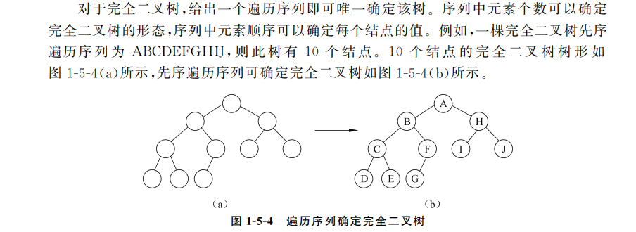

# 2024年秋季 数据结构课程笔记

## Lecture 7 树和二叉树的定义和性质

### 树的定义

定义：有一个**根节点**，记为$root(T)$。而其他节点被分为$m$个不相交的非空集合$T_1, T_2......T_m$，且它们又都是树，被称为$root(T)$的子树。
没有子节点的节点叫作**叶节点**

#### 有序树

$T_1, T_2......T_m$的次序被指明的树叫作有序树。

#### 树的相关术语

**度**：
一个节点的子节点的数目，记$D(i)$为节点$i$的度数
一棵树的度数为$max\{D(i)\quad 1\le i \le n\}$
度为$0$的节点被称为**叶节点**，度$>0$的点被称为分支节点
**节点的层数和深度**：
节点层数递归定义：

1. $root(T)$的层数为0
2. 其余节点层数为父节点加一

**树的高度**为树中节点的最大层数
注意：**节点的高度**为以该节点为**根**的子树的高度（特别注意此时节点所在层高度为$0$）

对于节点序列$v_mv_{m+1}...v_{m + k}$，若满足$v_{i + 1}$是$v_i$的子节点，则称此序列为$v_m$到$v_{m+k}$的**路径**，该路径遍历的边数长度$k$称为**路径长度**
注意到：从根节点到某个节点的路径恰为该节点的**层数**

一棵树中若存在从$v_m$到$v_n$的路径，则称$v_n$是$v_m$的子孙节点，称$v_m$是$v_n$的祖宗节点

### 二叉树的定义(Binary Tree)

特征：

1. 二叉树的每个节点最多只有两个子节点
2. 二叉树的子树有左右之分

#### 含有$n$个节点的二叉树所有可能的形态数量 && Catalan数

采取递推方程求解
首先考虑$n=1$情形，$f(1) = 1$
$n=2$时，满足$f(2) = f(1) + f(1) = 2$
$n \ge 3$时，选择固定一个点为根节点，然后把剩下的节点作为已经形成的树”接”到根节点上面。由此，有$f(3) = f(2) +f(1)*f(1)+f(2)$
考虑到一般情形$n$，由于去除根节点后剩余$n-1$个点，满足$n-1=n-1+0=(n-2)+1=......=1+(n-2)=0+(n-1)$；
由此，存在$f(n)=f(n-1)+f(n-2)*f(1)+......+f(1)*f(n-2)+f(n-1)$

注意到以上数列称作**卡特兰数**（$Catalan$数）
满足$\displaystyle f(n)=\frac{(2\times n)!}{n!\times (n+1)!}$

### 二叉树的性质

引理：**二叉树第$i$层至多有$2^i$个节点$(i\ge 0)$**

高度为$k(k\ge 1)$的二叉树至少有$k + 1$个节点

含有$k(k\ge 1)$个节点的二叉树高度至多为$k-1$

高度为$k$的二叉树至多有$2^{k+1}-1$个节点

引理：**在$n$个节点构成的二叉树中，若叶节点数量为$n_0$，度为2的节点个数为$n_2$，则有$n_0=n_2+1$**
>相应证明：不妨设度数为1的节点数量为$n_1$，并设边数和为$e$，由此，满足
$n=n_0+n_1+n_2$
$e = n - 1$（注意这个统计方式是从下往上看）
$e=n_1+2\times n_2$
由此，满足$n_1+2\times n_2=n-1=n_0+n_1+n_2-1$
即$n_0=n_2+1$

$P32，P33$分别选择$B、A$

#### 满二叉树

一棵非空且高度为$k$的满二叉树，含有$2^{k+1}-1$个节点

满二叉树的性质

1. 叶节点都在最后一层
2. 每个非叶结点都有两个子节点
3. 叶节点个数 = 非叶节点个数 + 1

#### 完全二叉树

特征：除了最后一层，每一层都达到最大节点数，最后一层节点从左至右依次出现

特点：

1. 只有最后两层节点的度可以小于2
2. 最后一层节点的位置都集中出现在最左边
3. **叶节点**只可能出现在最后两层
4. **对于所有节点，按照层次顺序从1开始编号，仅编号最大的非叶节点可以没有右孩子，其余的非叶结点都应当有两个子节点**

高度为$k$的完全二叉树最少有$2^k - 1 + 1=2^k$个节点

对于一个有n个节点的完全二叉树，按照层次顺序从1开始编号，对于编号为$i(1\le i \le n)$的节点满足

1. 若$i\not =1$，则编号为$i$的节点的父节点编号为$\displaystyle\lfloor\frac{i}{2}\rfloor$
2. 若满足$2\times i\le n$，则编号为$i$的节点的左孩子编号为$2\times i$，否则该节点没有左孩子
3. 若满足$2\times i+1\le n$，则编号为$i$的节点的右孩子编号为$2\times i + 1$，否则该节点没有右孩子

由上述定理可以得出以下重要推论
**一个具有$n$个节点的完全二叉树，其非叶节点个数为$\displaystyle\lfloor\frac{n}{2}\rfloor$，其叶节点个数为$\displaystyle\lceil\frac{n}{2}\rceil$**

引理：**$n$个节点的完全二叉树的高度为$\displaystyle\lfloor\log_{2}n\rfloor$**

不难得出结论：已知一个**完全二叉树**的第$n$层有$k$个叶节点，则该完全二叉树的节点个数$s$范围为$$2^n+k-1\le s\le 2^{n+2}-2\times k-1$$

## Lecture 8 二叉树的存储和操作

### 二叉树的存储结构

#### 二叉树的顺序存储

一个节点下标是$i$，则其左孩子存放在下标为$2i$处，右孩子存放在下标为$2i+1$处

#### 二叉树的链接存储

##### 二叉链表

```cpp
struct TreeNode{
    TreeNode* Left;
    TreeNode* Right;
    int val;
}
```

##### 三叉链表

```cpp
struct TreeNode{
    TreeNode* Left;
    TreeNode* Right;
    TreeNode* Parent;
    int val;
}
```

### 二叉树的遍历及其递归算法

#### 二叉树的遍历

注意到遍历过程每个节点仅访问一次
先根（中根、后根）遍历二叉树$T$，得到$T$节点的一个序列，称为$T$的先根（中根、后根）序列

#### 先根遍历算法

算法对应代码如下

```cpp
vector<int> preorderTraversal(TreeNode* root) {
        if(root){
            ans.push_back(root->val);
            preorderTraversal(root->left);
            preorderTraversal(root->right);
        }        
        return ans;
    }
```

时间复杂度$O(n)$，空间复杂度$O(h)(h为树的高度)$

#### 中根遍历算法

和先根遍历类似
算法对应代码如下

```cpp
class Solution {
public:
    vector<int> inorderTraversal(TreeNode* root) {
        if(root){
            inorderTraversal(root->left);
            ans.push_back(root->val);
            inorderTraversal(root->right);
        }
        return ans;
    }
private:
    vector<int> ans;
};
```

#### 后根遍历算法

完全是一个模子
算法对应代码如下

```cpp
class Solution {
public:
    vector<int> postorderTraversal(TreeNode* root) {
        if (root) {
            postorderTraversal(root->left);

            postorderTraversal(root->right);
            ans.push_back(root->val);
        }
        return ans;
    }

private:
    vector<int> ans;
};
```

P27页练习如下：先根遍历为$ABCDEFGH$，中根遍历为$CBEDFAGH$，后根遍历为$CEFDBHGA$

考研题：若要满足一棵非空二叉树的**先根序列**和**中根序列**相同，其所有**非叶节点**满足条件：只有右子树

### 遍历的非递归算法

二叉树过高时，递归遍历算法可能会导致**栈溢出**，由此要寻求非递归算法来遍历二叉树

#### 非递归先根遍历算法

算法的设计涉及到节点的遍历顺序：根、左、右，由此设计非递归算法
算法对应代码如下

```cpp
class Solution {
public:
    vector<int> preorderTraversal(TreeNode* root) {
        stack<TreeNode*> s;
        TreeNode* p = root;
        while (1)
        {
            while (p)
            {
                ans.push_back(p->val);
                s.push(p);
                p = p->left;
            }
            if(s.empty()) return ans;
            p = s.top()->right;
            s.pop();
        }
    }
private:
    vector<int> ans;
};
```

实际上这段代码中有一个细节点需要注意：叶节点第一个内层循环最后左侧遍历到的是一个没有左节点的节点

#### 非递归中根遍历算法

代码思路类似
算法对应代码如下

```cpp
class Solution {
public:
    vector<int> inorderTraversal(TreeNode* root) {
        stack<TreeNode*> s;
        TreeNode* p = root;
        while (1) {
            while (p) {
                s.push(p);
                p = p->left;
            }
            if (s.empty())
                return ans;
            p = s.top();
            s.pop();
            ans.push_back(p->val);
            p = p->right;
        }
    }

private:
    vector<int> ans;
};
```

#### 非递归后根遍历算法

注意到由于要先访问最底层的左子树和右子树，因此需要一个量先保存临时根节点
算法对应代码如下

```cpp
vector<int> postorderTraversal(TreeNode* root) {
        TreeNode* p = root, *Pre = nullptr;
        stack<TreeNode*> s;
        while (1)
        {
            while (p)
            {
                s.push(p);
                p = p->left;
            }
            if(s.empty()) return ans;
            p = s.top();
            if(p->right == nullptr || p->right == Pre){
                s.pop();
                ans.push_back(p->val);
                Pre = p;
                p = nullptr;
            } else{
                p = p->right;
            }
        }
        
    }
```

#### 非递归后根遍历算法2

此处自己实现了一个栈，计算节点进出栈的次数，并决定是否要对该节点数据进行访问
对应算法代码如下

```cpp
const int MaxSize = 1e2 + 10;
class Stack{
public:
    void Push(TreeNode* p, int i){Node[++top] = p; cnt[top] = i;}
    TreeNode* Pop(int& i){i = cnt[top]; return Node[top --];}
    bool IsEmpty(){return top == -1;}
    // pay attention to the function judging the stack is full
    bool IsFull(){return top == MaxSize - 1;}
private:
    int top = -1;
    TreeNode* Node[MaxSize];
    int cnt[MaxSize] = {0};
};

class Solution {
public:
    vector<int> postorderTraversal(TreeNode* root) {
        Stack s;
        if(root) s.Push(root, 1);
        while (!s.IsEmpty())
        {
            TreeNode* p;
            int num;
            p = s.Pop(num);
            if(num == 1){s.Push(p, 2); if(p->left){s.Push(p->left, 1);}}
            else if(num == 2){s.Push(p, 3); if(p->right){s.Push(p->right, 1);}}
            else if(num == 3){ans.push_back(p->val);}
        }
        return ans;
    }
private:
    vector<int> ans;
};
```

#### 层次遍历

对于二叉树的层次遍历算法，采用**广度优先搜索**，加上一个辅助队列
算法对应代码如下

```cpp
class Solution {
public:
    vector<vector<int>> levelOrder(TreeNode* root) {
        deque<TreeNode*> dq;
        if(root) dq.push_back(root);
        int Currentnum = 1;
        int NextNum = 0;
        while (!dq.empty())
        {
            vector<int> CurLevel;
            NextNum = 0;
            while (Currentnum --)
            {
                TreeNode* p = dq.front();
                dq.pop_front();
                CurLevel.push_back(p->val);
                if(p->left){dq.push_back(p->left); NextNum ++;}
                if(p->right){dq.push_back(p->right); NextNum ++;}
            }
            ans.push_back(CurLevel);
            Currentnum = NextNum;
        }
        return ans;
    }
private:
    vector<vector<int>> ans;
};
```

注意到上述代码中分别记录了当前层的节点数和下一层的节点数

#### 辅助队列的规模

对于$n$个节点构成的**完全二叉树**进行层次遍历，求辅助队列的容量最小值：
这道题的解题思路，从队列里取出一个点，那么至少要放进去一个其叶节点才能保持辅助队列元素个数向上增长或者维持平衡。那么，当遍历到最后一个非叶节点后，即达到辅助队列最大值临界点。**此时，辅助队列中的节点全部为叶节点。而完全二叉树的叶节点个数为$\displaystyle\lceil\frac{n}{2}\rceil$**
由此，得出结论：
>对于$n$个节点构成的完全二叉树，在层次遍历算法中，其辅助队列元素个数峰值为$\displaystyle\lceil\frac{n}{2}\rceil$

P62页判断题应该是对的

#### 统计二叉树每层节点的信息

这道题没有找到对应的oj练习。。。看一下思路得了
给的三种解题思路

##### 思路1：插入空节点分隔各层

对应算法代码如下

```cpp
int LeafInEachLevel(TreeNode* root, int LeafNum[]){
    if(!root) return -1;
    int Level = 0;
    deque<TreeNode*> s;
    s.push_back(root);
    s.push_back(nullptr);
    while (!s.empty())
    {
        TreeNode* p = s.front();
        s.pop_front();
        if(!p){
            if(p->Left == nullptr && p->Right == nullptr){
                LeafNum[Level] ++;
            }
            if(p->Left){s.push_back(p->Left);}
            if(p->Right){s.push_back(p->Right);}
        }else {
            if(!s.empty()) s.push_back(nullptr);
            Level ++;
        }
    }
    return Level - 1;
}
```

##### 思路2：记录每层节点的数目

实际上这个记录数目的操作可以调用$deque$的库函数$size()$完成
算法对应代码如下

```cpp
int LeafInEachLevel(TreeNode* root, int LeafNum[]){
        if(!root) return -1;
        int Level = 0; deque<TreeNode*> s;
        s.push_back(root);
        while (!s.empty())
        {
            int Len = s.size();
            while (Len --)
            {
                TreeNode* p = s.front();
                s.pop_front();
                if(p->Left == nullptr && p->Right == nullptr) LeafNum[Level] ++;
                if(p->Left) s.push_back(p->Left);
                if(p->Right) s.push_back(p->Right);
            }
            Level ++;
        }
        return Level - 1;
 }
```

实际上编程时总是对于$<stack>$和$<queue>$总是忘记$size()$库函数，需要引起注意！

##### 思路3：采用先根遍历，在记录层数的同时统计叶节点

码量很少，**递归**的思想值得注意
算法对应代码如下

```cpp
void LeafInEachLevel(TreeNode* root, int LeafNum[], int k){
        if(!root) return;
        if(k > H) H = k;
        if(root->Left == nullptr && root->Right == nullptr) LeafNum[k] ++;
        LeafInEachLevel(root->Left, LeafNum, k + 1);
        LeafInEachLevel(root->Right, LeafNum, k + 1);
    }
```

### 二叉树的重建和计数

#### 二叉树的重建

注意到：可以通过**先根序列和中根序列**确定**唯一**的一棵二叉树
即由中根序列确定左右孩子的组成，当然在此之前先由先根序列确定根是什么

P82选择$E$

ppt给的关于重建树的代码时间复杂度为$O(nlogn)$，但是还有更好的思路

##### 算法1：递归+哈希表

实际上，对于中根遍历的节点信息和其出现次序可以用一个哈希表记录，从而减少查找时间
算法对应代码如下

```cpp
class Solution {
public:
    TreeNode* buildTree(vector<int>& preorder, vector<int>& inorder) {
        int Len = preorder.size();
        for(int i = 0;i < Len;i ++){
            mp[inorder[i]] = i;
        }
        return MyBuildTree(preorder, inorder, 0, Len - 1, 0, Len - 1);
    }
private:
    unordered_map<int, int> mp;
    TreeNode* MyBuildTree(const vector<int>& preorder, const vector<int>& inorder, int PreLf, int PreRg, int InLf, int InRg){
        if(PreLf > PreRg) return nullptr;
        TreeNode* root = new TreeNode;
        int num = preorder[PreLf];
        int k = FindPositonOfRoot(num);
        root->val = num;
        root->left = MyBuildTree(preorder, inorder, PreLf + 1, k - 1 - InLf + 1 + PreLf, InLf, k - 1);
        root->right = MyBuildTree(preorder, inorder, PreLf + k - InLf + 1, PreRg, k + 1, InRg);
        return root;
    }
    int FindPositonOfRoot(int val){
        return mp[val];
    }
};
```

##### 算法2：迭代

对于这个算法的解释：建立一个栈和一个指针，栈从先根遍历序列开始记录，指针从中根遍历开始记录。**注意到一个事实：先根序列顺序为根左右，中根序列顺序为左根右**，由此，栈中记录元素为当前节点的所有还没统计过右孩子的祖先节点，而**栈顶即为当前节点**，指针指向当前节点向左走到的最终节点。

注意到：遍历的先根序列中的节点如果和指针指向的节点不同，则作为当前栈顶元素的左孩子入栈。如果和当前指针指向的节点相同，那么节点先入栈。随后栈依次弹出节点，指针不断后移，当移动到最后一个栈顶节点与指针指向节点相同时，该栈顶节点作为当前遍历的先根序列节点后一个节点的父亲。

算法对应代码如下

```cpp
class Solution {
public:
    TreeNode* buildTree(vector<int>& preorder, vector<int>& inorder) {
    // 这边的麻烦在于构造的节点会发生重复，这该如何解决？
    // 解决方案是直接一步到位，不采用记录节点信息，而是直接栈记录节点本身
        if(!preorder.size()) return nullptr;
        stack<TreeNode*> s;
        TreeNode* root = new TreeNode(preorder[0]);
        s.push(root);
        int InorderIndex = 0;
        for(int i = 1;i < preorder.size();i ++){
            TreeNode* node = s.top();
            if(s.top()->val != inorder[InorderIndex]){
                TreeNode* p = new TreeNode(preorder[i]);
                node->left = p;
                s.push(p);
            } else{
                while (!s.empty() && s.top()->val == inorder[InorderIndex])
                {
                    node = s.top(); s.pop(); InorderIndex ++;
                }
                TreeNode* p = new TreeNode(preorder[i]);
                node->right = p;
                s.push(p);
            }
        }
        return root; 
    }
};
```

#### 二叉树的计数

由于**先根序列和中根序列可以确定一棵二叉树**。
对于二叉树遍历的非递归算法，可以发现：
**节点进栈的顺序为先根访问的顺序，节点出栈的顺序为中根访问的顺序**
也就是说，**进栈序列 = 先根序列**，**出栈序列 = 中根序列**
实际上，这个问题**等价于**“对于进栈序列$1\dots n$，有多少种合法的出栈序列”
答案是显然的
>$n$个节点的二叉树的可能形态数量$sum$满足$$\large sum = \frac{1}{n + 1}C_{2n}^n = Catalan(n)$$

#### 关于二叉树重建的分类讨论

可以由**中根序列**和**后根序列**确定一棵**唯一**的二叉树
（实际上是因为中根序列可以确定根节点左右两端的节点是什么）

由**先**根序列和**后**根序列**不能**确定唯一的二叉树
（很显然，没法确定左右孩子是谁）

由**层次遍历序列**无法确定唯一的一棵二叉树

>**中根序列与任意一种其它遍历序列都可以唯一确定一棵二叉树**

##### 重建二叉树与完全二叉树

完全二叉树具有**只有可能最后一层不是满的，并且最后一层节点都在左边的性质**
并且，可以通过节点个数计算完全二叉树的高度。此外，可以计算**叶节点**和**非叶节点**的个数，以及叶节点和非叶节点编号之间的关系。由此，**实际上可以确定这个完全二叉树的框架**
因此：
对于**完全二叉树**，无论是先根、中根、后根还是层次序列，都可以确定一棵唯一的二叉树。


正如教材所言

##### 先根序列&&后根序列

由先根序列和后根序列可以唯一确定层次遍历序列

给定先根序列和后根序列，求解对应的可能的二叉树结构数量
注意到在先根序列中有$\dots XY \dots$，并对应的在后根序列中有$\dots YX\dots$
联系到左右孩子在先根和后根中的出现组合是相一致的，那么就是左孩子+根$or$右孩子+根的可能性
算法对应代码如下

```cpp
ll CalculateTreeNumber(char* PreOrder, char* PostOrder){
    int LenPre = strlen(PreOrder), LenPost = strlen(PostOrder);
    ll ans = 1;
    for(int i = 0;i < LenPre - 1;i ++){
        for(int j = 1;j < LenPost;j ++){
            if(PreOrder[i] == PostOrder[j] && PreOrder[i + 1] == PostOrder[j - 1]) ans <<= 1;
        }
    }
    return ans;
}
```

### 二叉树的其它操作

#### 二叉树中搜索给定节点的父节点

算法：递归 + 分治
对应代码如下

```cpp
TreeNode* FindFather(TreeNode* root, TreeNode* p){
// the funtion used to find the father node of p
    if(!root || root == p) return nullptr;
    // recursive need the situation of judging
    if(root->Left == p || root->Right == p) return root;
    TreeNode* father = FindFather(root->Left, p);
    if(!father) return father;
    else return FindFather(root->Right, p);
}
```

注意：**实际上，左右分治处理子树的递归思想常见于对二叉树的处理之中**

#### 搜索二叉树中符合数据域条件的节点

算法：递归 + 分治
对应代码如下

```cpp
TreeNode* ConformToData(TreeNode* root, int data){
    if(!root) return nullptr;
    if(root->val == data) return root;
    TreeNode* p = ConformToData(root->Left, data);
    if(!p) return p;
    return ConformToData(root->Right, data);
}
```

#### 释放二叉树

算法：还是递归+分治
对应代码如下

```cpp
void DeleteTree(TreeNode* root){
    if(!root) return ;
    DeleteTree(root->Left);
    DeleteTree(root->Right);
    delete root;
    root = nullptr; // prevent memory leaks !!!
}
```

#### 在以$t$为根的二叉树中删除$p$指向的子树

首先明确题意，p指向的子树就是要把p这个节点作为根节点的子树也删了！
那么就有两件事，一个是删除p节点，还一个是把p节点的父节点指向空
对应算法代码如下

```cpp
void DeleteSubTree(TreeNode* root, TreeNode* p){
    if(!root) return;
    if(root == p){DeleteTree(root); return;}
    TreeNode* Father = FindFather(root, p);
    Father->Left = Father->Right = nullptr;
    DeleteTree(p);
}
```

#### 创建二叉树

可以通过**增强先根序列**构建二叉树
对于一串先根序列，空节点用0表示，构建二叉树可以采用递归的办法
算法对应代码如下

```cpp
TreeNode* BuildTree(){
    int data; scanf("%d", &data);
    if(data == 0) return nullptr;
    TreeNode* p = new TreeNode(data);
    p->val = data;
    p->Left = BuildTree();
    p->Right = BuildTree();
    return p;
}
```

#### 复制二叉树

算法思路：从下往上复制，由此，需要使用递归的思想
对应代码如下

```cpp
TreeNode* CopyTree(TreeNode* root){
    if(!root) return nullptr;
    TreeNode* NewLeft = CopyTree(root->Left);
    TreeNode* NewRight = CopyTree(root->Right);
    TreeNode* NewRoot = new TreeNode(root->val);
    NewRoot->Left = NewLeft;
    NewRight->Right = NewRight;
    return NewRoot;
}
```

#### 计算二叉树节点总数

这个没什么可说的，还是分而治之的思想。**递归**在二叉树中的用处非常大
对应算法代码如下

```cpp
int CalculateTreeNode(TreeNode* root){
    if(!root) return 0;
    return 1 + CalculateTreeNode(root->Left) + CalculateTreeNode(root->Right) + 1;
}
```

#### 计算二叉树高度

$depth(t)=\begin{cases}
    -1\quad root == NULL\\
    max\{depth(root\to left), depth(root\to right)\} + 1\quad root != NULL
\end{cases}$

对应算法代码如下：

```cpp
int CalculateTreeDepth(TreeNode* root){
    if(!root) return -1;
    int LeftDepth = CalculateTreeDepth(root->Left);
    int RightDepth = CalculateTreeDepth(root->Right);
    return (LeftDepth > RightDepth) ? LeftDepth + 1 : RightDepth + 1;
}
```

#### 求取二叉树中、先、后根的首末节点

要求限制：不使用递归，不使用栈

##### 中根序列

注意遍历序列顺序：左、根、右

寻找序列首个节点的相应代码如下（即找到首个没有左孩子的节点）

```cpp
TreeNode* FindFirstNodeOfInOrderSequence(TreeNode* root){
    if(!root) return nullptr;
    TreeNode* p = root;
    while (p->Left)
    {   
        p = p->Left;
    }
    return p;
}
```

寻找序列末个节点的相应代码如下（即找到首个没有右孩子的节点）

```cpp
TreeNode* FindLastNodeOfInorderSequence(TreeNode* root){
    if(!root) return nullptr;
    TreeNode* p = root;
    while (p->Right) p = p->Right;
    return p;
}
```

##### 先根序列

寻找序列首个节点的代码如下：

```cpp
TreeNode* FindFirstNodeOfPreOrderSequence(TreeNode* root){
    return root;
}
```

寻找序列末个节点的代码如下：（注意到最后一个节点既可能是左孩子，又可能是右孩子）

```cpp
TreeNode* FindLastNodeOfPreOrderSequence(TreeNode* root){
    if(!root) return root;
    TreeNode* p = root;
    while (p)
    {
        if(p->Right) p = p->Right;
        else if(p->Left) p = p->Left;
        else return p;
    }
}
```

##### 后根序列

寻找序列的首个节点的代码如下：

```cpp
TreeNode* FindFirstNodeOfPostOrderSequence(TreeNode* root){
    if(!root) return root;
    TreeNode* p = root;
    while (p)
    {
        if(p->Left) p = p->Left;
        else if(p->Right) p = p->Right;
        else return p;
    }
}
```

寻找序列的末个节点的代码如下：（这个没什么好解释的）

```cpp
TreeNode* FindLastNodeOfPostOrderSequence(TreeNode* root){
    return root;
}
```

#### 二叉树的路径

目标：输出根到叶的所有路径
算法思路：利用先根遍历，递归记录到当前节点之前的所有节点到一个数组中去
对应代码如下

```cpp
void FindPath(TreeNode* root, int Data[], int k){
    if(!root) return;
    Data[k] = root->val;
    if(root->Left == nullptr && root->Right == nullptr){
        for(int i = 0;i <= k;i ++){
            printf("%d", Data[i]);
        }
        return ;
    }
    FindPath(root->Left, Data, k + 1);
    FindPath(root->Right, Data, k + 1);
}
```

## Lecture 9 线索二叉树

### 动机与基本概念

#### 概念

中根序列中节点的前驱为**中根前驱**，节点的后继为**中根后继**

#### 关于线索二叉树的动机

包含$n$个节点的二叉树中，在其$2n$个指针域中只有$n - 1$个被使用

#### 线索二叉树的结构

树的结构中增加两个字段$LThread$和$RThread$
满足$$LThread = \begin{cases}
    0, Left指向该节点的左孩子\\
    1, Left指向该节点的某根前驱
\end{cases}$$ $$RThread = \begin{cases}
    0, Right指向该节点的右孩子\\
    1, Right指向该节点的某根后继
\end{cases}$$
注意到在中序线索二叉树中，序列首节点必无左孩子，序列末节点必无右孩子

总而言之，线索二叉树的目的是在某序线索二叉树中能快速地找到某序前驱和某序后继，并且无需更多空间
结论
> 在线索二叉树中，一个节点是叶子节点$\iff$左右标志($LThread, RThread$)均为$1$

### 中序线索二叉树的基本操作

#### 找中序线索二叉树的中根序列的第一个节点

从根一直往左遍历，直到没有左孩子为止
算法对应代码如下

```cpp
TreeNode* FindFirstInOrder(TreeNode* root){
    TreeNode* p = root;
    while(p->LThread == 0){
        p = p->Left;
    }
    return p;
}
```

时间复杂度为$O(h)$，$h$为二叉树高度

#### 找中序线索二叉树的中根序列的最后一个节点

从根一直往右遍历，直到没有右孩子为止
算法对应代码如下

```cpp
TreeNode* FindLastInOrder(TreeNode* root){
    TreeNode* p = root;
    while(p->RThread == 0){
        p = p->Right;
    }
    return p;
}
```

时间复杂度为$O(h)$，$h$为二叉树高度

#### 在中序二叉树中，查找节点$p$的中根后继节点

当$p->Thread = 1$，中根后继即为$p->Right$
当$p->Thread = 0$，中根后继即为$p$指向的右子树的中根序列的首个节点
算法对应代码如下

```cpp
TreeNode* NextInOrder(TreeNode* p){
    if(p->Thread == 1) return p->Right;
    if(p->Thread == 0) return FindFirstInOrder(p->Right);
}
```

#### 在中序线索二叉树中，查找节点$p$的中根前驱节点

思想类似，算法相应代码如下

```cpp
TreeNode* PreInOrder(TreeNode* p){
    if(p->Thread == 1) return p->Left;
    if(p->Thread == 0) return FindLastInOrder(p->Left);
}
```

#### 中序线索二叉树的中根遍历

可以做到时间复杂度为$O(n)$，空间复杂度为$O(1)$
算法对应代码如下

```cpp
void TraverseTree(TreeNode* root){
    for(TreeNode* p = FindFirstInOrder(root->Left);p;p = NextInOrder(p)){
        Visit(p->val);
    }
}
```

#### 二叉树的中序线索化

设置一个**全局变量**指针$pre$始终指向当前访问指针$p$的中根前驱节点
算法解释：先线索化根的左子树，再线索化根，最后线索化根的右子树
还是运用递归的思想
算法对应代码如下

```cpp
TreeNode* pre = nullptr;
void InOrder_Threading(TreeNode* root){
    if(!root) return;
    InOrder_Threading(root->Left);
    // 注意左指针当没有左孩子时指向中根前驱！！
    if(root && root->Left){root->LThread = 0;}
    else if(root){root->LThread = 1; root->Left = pre;}
    if(pre && pre->Right){pre->RThread = 0;}
    else if(pre){pre->RThread = 1; pre->Right = p;}
    pre = root;
    InOrder_Threading(root->Right);
}
//注意算法结束后，需要将$pre$的右线索修改！！！
pre->RThread = 1;
```

当节点结构中没有父指针时，**前序线索二叉树无法高效解决查找节点先序前驱，而后序线索二叉树无法高效解决查找节点后序后驱**。
简而言之：这两个线索二叉树没用
